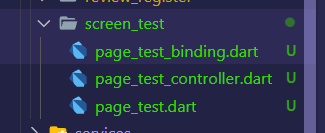
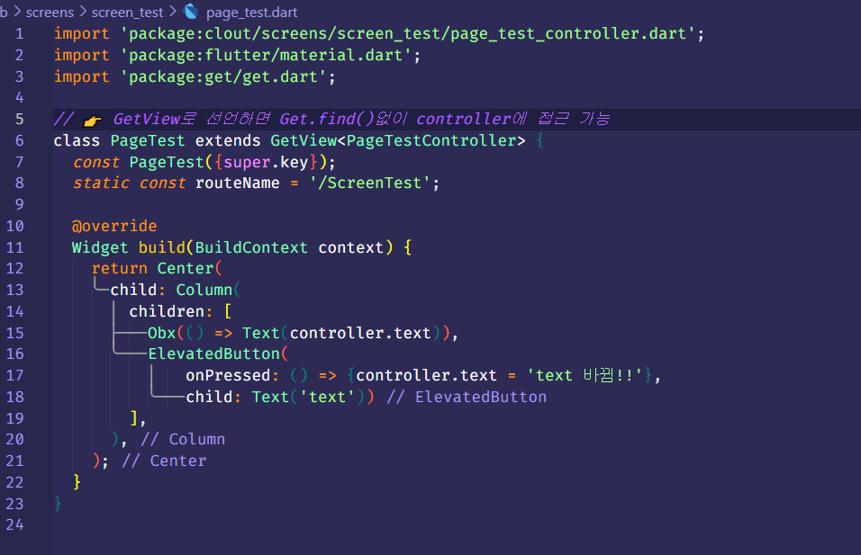
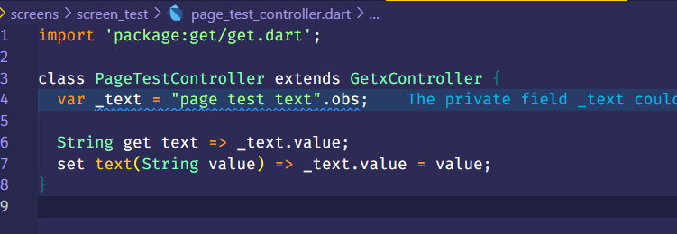
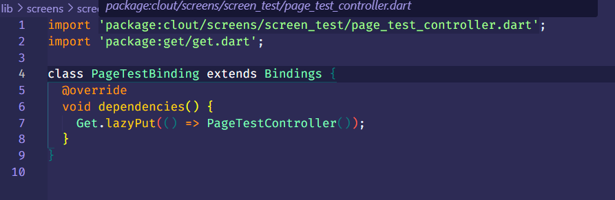
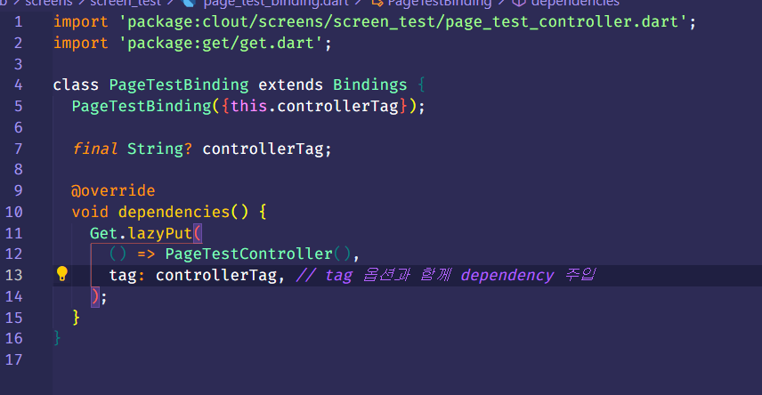
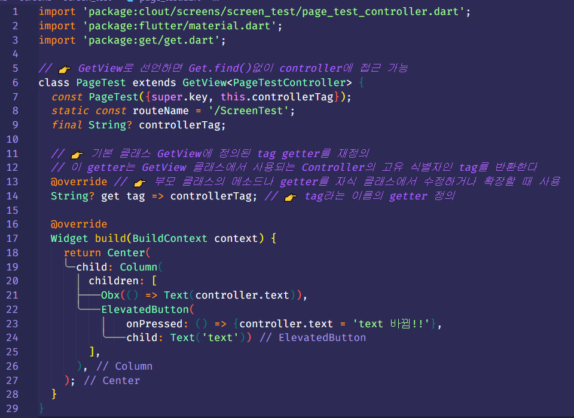

# Controller Tag

Created by: Boyeon Kim
Created time: November 22, 2023 10:44 AM
Tags: Frontend Study



- get으로 Page랑 controller를 만들고, 여러 군데에서 재사용해야 할 때가 있음
    - Page(Widget)은 그냥 쓰면 되지만 GetxController의 instance가 독립적으로 생성되게 하기 위해서는 binding할 때 `tag 옵션`을 줘야한다







```dart
return Navigator(
  key: Get.nestedKey(NavKeys.home.index),
  initialRoute: ScreenHome.routeName,
  onGenerateRoute: ((settings) {
  ...
    return GetPageRoute(
      page: () => PageTest(),
      binding: PageTestBinding(),
    );
  ...
}
```

<aside>
💡 이렇게 하면 controller를 공유하기 때문에 다른 탭의 state가 함께 변한다. tag를 사용해서 해당 문제를 해결할 수 있음

</aside>

## 🏷️ Controller Tag



- `Get.lazyPut` 에서 입력받은 controllerTag와 함께 dependency 주입.
- Page에서도 마찬가지로 입력받은 controller를 get tag에 override 해주기



- GetPage나 GetPageRoute 할 때 tag만 넣어주면 끝

```dart
case PageTest.routeName:
  return GetPageRoute(
    page: () => PageTest(controllerTag: "홈"),
    binding: PageTestBinding(controllerTag: "홈"),
  );
```

- binding을 사용하지 못하는 경우나 page 밖에서 controller에 접근하는 경우 반드시 tag를 지정해줘야함. controller가 주입되지 않았다며 오류남

```dart
var controller = Get.find<PageTestController>(tag: "홈");
```
