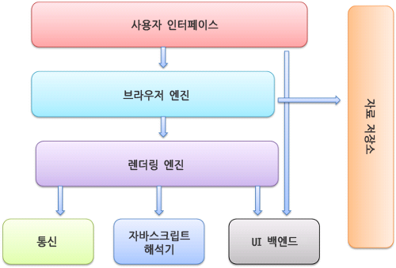

# Front-end Study day05 🐬

# `Javascript`

# 브라우저

## 브라우저의 기능

- 사용자가 선택한 자원을 서버에 요청하고 그것을 해석하여 브라우저에 표시하는 것.
- 대부분 HTML 문서지만 제공하는 기능에 따라 PDF나 이미지, 또는 다른 형태의 파일일 수도 있다.
- 이러한 자원의 주소는 URI(Uniform Resource Identifier)에 의해 정해진다.

<br>

<br>

## 브라우저의 구조

1. 사용자 인터페이스(UI) : 요청한 페이지를 보여주는 창을 제외한 모든 부분으로 주소 표시줄, 이전 / 다음 버튼, 북마크 메뉴 등이 이에 해당한다
2. 브라우저 엔진 : 사용자 인터페이스와 렌더링 엔진 사이의 동작을 제어한다
3. 렌더링 엔진 : 요청한 컨텐츠를 표시한다. 만약 HTML을 요청하면 HTML과 CSS를 파싱(해석)하여 화면에 표시
4. 통신 : HTTP 요청과 같은 네트워크 호출에 사용된다. 이것은 플랫폼의 독립적인 기능이고 각 플랫폼의 하부에서 실행된다. 
5. UI 백엔드 : 콤보박스나 글 입력 폼 등의 기본적인 장치를 그린다. 브라우저가 동작하고 있는 운영체제의 인터페이스를 따르는 UI들을 처리한다. 플랫폼에서 명시하지 않은 인터페이스로 OS 사용자 인터페이스 체계를 사용한다. 얼럿(alert)이나 셀렉트 박스(select)등이 있다. 
6. 자바스크립트 해석기 : 자바스크립트 코드를 해석하고 실행
7. 자료 저장소 : 자료를 저장하는 계층으로 쿠키나 로컬 스토리지 등의 자료가 저장되는 저장소이다. 이는 하드디스크에 저장되며 HTML 명세 등도 이 곳에 저장된다.



<br>

<br>

### 브라우저 엔진

- 사용자 인터페이스와 렌더링 엔진 사이에서 중개자 역할을 한다
- 사용자 인터페이스를 통해 들어온 액션이 이것을 해석하여 적절한 명령을 수행하거나 전달한다

<br>

<br>

### 렌더링 엔진

- 렌더링 엔진의 역할은 사용자로부터 요청받은 내용을 브라우저 화면에 표시하는 일, HTML, XML, 이미지 등 표시 가능
- 렌더링 엔진의 동작 과정


1. HTML 파싱 : 렌더링 엔진은 먼저 HTML 문서를 파싱하고 콘텐츠 트리 내부에서 태그를 DOM노드로 변환. 그 다음 외부 CSS파일에 포함된 스타일 요소도 파싱한다. 그 후 스타일 정보와 HTML 표시 규칙은 렌더 트리라고 부르는 또 다른 트리를 구축한다.
2. 렌더 트리 구축 : 렌더 트리는 색상 또는 면적과 같이 시각적 속성이 있는 사각형을 포함하고 있는데 이를 정해진 순서대로 화면에 표시하는 역할을 한다. 
3. 렌더 트리 배치 : 렌더 트리 구축이 끝나면 실제 배치가 시작되는데 이것은 각 DOM노드가 정해진 위치에 표시하는 것을 의미
4. 렌더 트리 그리기 : 이 과정은 UI 백엔드에서 실행되며 렌더 트리의 각 노드를 거치며 형상을 만들어내는 과정

✔️ 이러한 일련의 과정이 순서대로 진행되는 것이 렌더링 엔진이다. 최신 렌더링 엔진들은 좀 더 빠르고 쾌적한 사용자 경험을 위해 모든 HTML을 파싱할 때 까지 기다리는 것이 아닌 배치와 그리기 과정부터 시작하고, 그 후 네트워크로부터 나머지 내용(사용자 이름이나 글 제목, 본문)을 전송받는대로 화면에 표시한다. 

<br>

<br>

### Webkit과 Gecko 의 차이점

- 사파리와 크롬의 렌더링 엔진 : Webkit
    - Webkit은 렌더 객체로 구성되어 있는 **렌더 트리(render tree)**를 사용하고 요소를 배치하는데 **배치(layout)**라는 용어 사용
    


<br>

<br>

- 파이어폭스의 렌더링 엔진 : Gecko
    - 렌더 트리를 **형상 트리(frame tree)**라고 부르며 각 요소를 **형상(frame)**이라고 부른다
    - 요소를 배치하는데는 **리플로(reflow)**라는 용어 사용


✔️ 두 렌더링 엔진이 용어를 약간 다르게 사용하고 있지만 동작 과정은 기본적으로 동일.

<br>

<br>

### 파싱

- DOM 트리를 구축하기 위해서는 먼저 파싱 과정을 거쳐야 함.
- 브라우저가 코드를 이해할 수 있는 구조로 변환하는 과정을 의미하며 파싱 결과는 보통 문서 구조를 나타내는 노드 트리인데 이를 파싱 트리 또는 문법 트리라고 함
- 파싱은 어휘 분석과 구문 분석으로 분류할 수 있다


- 문서 : 렌더링 엔진에 전송되는 HTML 문서
- 어휘 분석 : 자료를 토큰으로 분해하는 과정. 토큰은 용어집이라고 할 수 있는데 쉽게 설명하자면 사전에 등장하는 모든 단어에 해당. 이 과정에서 공백과 줄 바꿈과 같은 의미없는 문자들을 제거
- 구문 분석 : 언어의 구문 규칙을 적용하는 과정
- 파싱의 마지막 단계에 위치한 파서는 구문 분석으로 얻은 정보를 토대로 문서 구조를 분석해 파싱 트리 생성. 이 과정은 반복되며 어휘 분석단계로부터 토큰을 받아 구문 분석에서 제공한 규칙 정보와 일치하는지 검사함 , 값이 참이면 해당 노드가 파싱 트리에 추가되고 파서는 또 다른 토큰을 요청.
    - 만약 규칙에 맞지 않으면 파서는 토큰을 내부적으로 저장하고, 이에 일치하는 규칙이 발견될 때 까지 계속해서 구문 분석을 요청. 맞는 규칙이 없을 경우 예외처리 되는데 이는 문서가 유효하지 않고 구문 오류를 포함하고 있다는 의미

<br>

<br>

### HTML 파싱과 DOM 생성

- 응답된 HTML 문서는 순수한 텍스트이므로 이를 브라우저가 이해할 수 있는 자료구조로 변환하여 메모리에 저장해야 한다.
    - 따라서 HTML 문서를 파싱해서 브라우저가 이해할 수 있는 자료구조인 DOM(Document Object Model)을 생성하는 것


1. 서버는 브라우저가 요청한 HTML 파일을 읽어들여 메모리에 저장한 다음 메모리에 저장된 바이트(2진수)를 인터넷을 경유하여 응답한다
2. 브라우저는 바이트(2진수) 형태의 HTML 문서를 받아서 meta 태그의 charset 어트리뷰트에 의해 지정된 인코딩 방식(예: UTF-8) 으로 문자열로 변환한다
3. 문자열로 변환된 HTML 문서를 읽어 들여 문법적 의미를 갖는 코드의 최소 단위인 토큰들로 분해한다
4. 토큰들의 내용에 따라 객체로 변환하여 각 노드들을 생성한다 (문서 노드, 요소 노드, 어트리뷰트 노드, 텍스트 노드)
5. HTML은 요소 간의 부자 관계인 중첩 관계를 갖는데, 이를 반영하여 모든 노드들을 트리 구조로 구성하여 DOM을 만든다

<br>

<br>

### CSS 파싱과 CSSOM 생성

- 렌더링 엔진은 HTML 문서를 처음부터 한 줄씩 순차적으로 파싱하여 DOM을 생성해 나가는데, CSS를 로드하는 `link` 태그나 `style` 태그를 만나면 DOM 생성을 일시 중단한다.
- 그리고 `link` 태그의 `href` 에 지정된 CSS 파일을 서버에 요청하고 응답을 받으면, HTML과 동일한 파싱 과정을 거쳐 CSSOM을 생성하고 작업이 완료되면 다시 DOM 생성을 이어나간다.

<aside>
💡 서버로부터 응답된 CSS 파일을 바이트 → 문자 → 토큰 → 노드 → CSSOM 의 과정을 거쳐 CSSOM을 생성한다.

</aside>

- CSSOM은 CSS의 상속의 개념을 반영하여 생성되는데, `body` 요소에 `font-size` 가 적용되어 있다면 하위의 모든 요소에도 적용된다

```jsx
body {font-size: 12px;}
ul {list-style-type: none;}
```


<br>

<br>

### 렌더 트리 생성

- 렌더링 엔진은 서버로부터 응답된 HTML과 CSS를 파싱하여 각각 DOM과 CSSOM을 생성하고 렌더링을 위한 렌더 트리로 결합된다
- 브라우저 화면에 렌더링 되지 않는 노드(예: meta 태그, script 태그)와 CSS에 의해 비표시(예: display:none;) 되는 노드들은 포함하지 않는다


<br>

<br>

### 레이아웃 계산

- 브라우저의 뷰포트(Viewport: 브라우저에서 페이지가 그려지는 영역) 내에서 렌더 트리 노드들이 가지고 있는 스타일과 속성에 따라서 브라우저 화면에 어떻게 그릴지 정확한 위치와 크기를 계산한다.
- `%` `vw` `vh` 와 같은 단위들이 뷰포트 크기에 맞게 픽셀 단위로 변환된다.


<br>

<br>

### 페인트

- 브라우저 화면에 실제 노드들이 픽셀 단위로 나타나도록 렌더 트리가 페인팅 처리에 입력되도록 paint 메서드가 호출된다.
- 이 때 처리해야하는 스타일이 복잡할수록 소요되는 시간이 늘어나게 된다.
    - 단색의 경우는 빠르지만 그라데이션이나 그림자 효과 등은 소요 시간이 비교적 더 오래걸린다.


<br>

<br>

<br>

## 리플로우와 리페인트

- 만약 자바스크립트 코드에 DOM이나 CSSOM을 변경하는 DOM API가 사용된 경우, 변경된 DOM과 CSSOM은 다시 렌더 트리로 결합되고 레이아웃 계산이나 페인트 처리를 하게 되는데, 이를 리플로우, 리페인트라 한다
- 리플로우는 레이아웃을 다시 계산하는 것을 말하는데 색상이 아닌 노드의 추가나 삭제, 크기나 위치를 다시 계산하는 것을 말한다
- 리페인트는 레이아웃에 영향이 없는 경우 리플로우 없이 실행될 수 있다

<br>

<br>

### 리플로우가 일어나는 경우

- 페이지 초기 최초 렌더링
- 윈도우 리사이징(Viewport 크기 변경 시)
- 자바스크립트에 의한 노드 추가 또는 삭제
- position, width, height, top, right, bottom, left, margin, padding, border, border-width, clear, display, float, font-family, font-size, font-weight, line-height, min-height, overflow, text-align, vertical-align, white-space ...

<br>

<br>

### 리페인트가 일어나는 경우

- 레이아웃에는 영향을 주지 않는 스타일 속성이 변경되었을 때는 리플로우 없이 리페인트만 일어난다
- background, background-image, background-position, background-repeat, background-size, border-radius, border-style, box-shadow, color, line-style, outline,  outline-color, outline-style, outline-width, text-decoration, visibility

<br>

<br>

### 리플로우, 리페인트 줄이는 방법

- `top` `left` `width` `height` 보다 `transform` 사용
- `visibility` `display` 보다 `opacity` 사용
- 클래스 변화에 따라 스타일을 변경할 때, 최대한 DOM 구조 상 끝단에 위치한 노드에 주기
- 인라인 스타일을 최대한 배제
- 애니메이션에 들어간 엘리먼트에 `position: fixed` 또는 `position: absolute` 로 지정하여 다른 요소들의 레이아웃에 영향을 끼치지 않게 한다
- 테이블을 사용한 레이아웃 피하기 : 테이블을 모두 로드되고 계산된 후에 화면에 뿌려지므로 테이블 레이아웃에 작은 변화가 있으면 해당 테이블 전체 노드에 대한 리플로우를 발생시킨다. 따라서 레이아웃 용도가 아닌 데이터 표시의 올바른 용도로 사용하되 `table-layout: fixed` 속성을 주는 것이 디폴트 값인 `auto` 에 비해 성능면에서 더 좋다
- 자바스크립트를 통해 스타일 변화를 줄 때 여러줄이 아닌 한 줄로 처리하기

```jsx
var toChange = document.getElementById('elem');
toChange.style.background = '#333';
toChange.style.color = '#fff';
toChange.style.border = '1px solid #ccc';

/* CSS */
#elem { border:1px solid #000; color:#000; background:#ddd; }
.highlight { border-color:#00f; color:#fff; background:#333; }
/* js */
document.getElementById('elem').className = 'highlight';
```

<br>

<br>

<br>

## JWT(Json Web Token)

### JWT 개념

- Json 포맷을 이용하여 사용자에 대한 속성을 저장하는 Claim 기반의 WebToken이다
- JWT는 토큰 자체를 정보로 사용하는 self-contained 방식으로 정보를 안전하게 전달한다
- 주로 회원 인증이나 정보 전달에 사용되는 JWT는 아래의 로직을 따라서 처리된다


- 애플리케이션이 실행될 때, JWT를 static 변수와 로컬 스토리지에 저장하게 된다.
    - static 변수에 저장되는 이유는 HTTP 통신을 할 때마다 JWT를 HTTP 헤더에 담아서 보내야 하는데, 이를 로컬스토리지에서 계속 불러오면 오버헤드가 발생하기 때문
- 클라이언트에서 JWT를 포함해 요청을 보내면 서버는 허가된 JWT 인지를 검사한다
- 또한 로그아웃을 할 경우 로컬 스토리지에 저장된 JWT 데이터를 제거한다
    - 실제 서비스의 경우에는 로그아웃 시에 사용했던 토큰을 blacklist 라는 DB 테이블에 넣어 해당 토큰의 접근을 막는 작업을 해주어야 한다.

<br>

<br>

### JWT 구조

- `JWT`는 `Header`, `Payload`, `Signature`의 3부분으로 이루어지며, `Json`형태인 각 부분은 `Base64`로 인코딩 되어 표현
- `Base64` 는 암호화 된 문자열이 아니고, 같은 문자열에 대해 항상 같은 인코딩 문자열을 반환한다


<br>

<br>

### JWT의 단점 및 고려사항

- **Self-contained :** 토큰 자체에 정보를 담고 있으므로 양날의 검이 될 수 있다.
- Token Length ****: 토큰의 페이로드(Payload)에 3종류의 클레임을 저장하기 때문에, 정보가 많아질수록 토큰의 길이가 늘어나 네트워크에 부하를 줄 수 있다.
- **Payload 인코딩** : 페이로드(Payload) 자체는 암호화 된 것이 아니라, BASE64로 인코딩 된 것. 중간에 Payload를 탈취하여 디코딩하면 데이터를 볼 수 있으므로, 암호화하거나 Payload에 중요 데이터를 넣지 않아야 한다.
- **Stateless** : JWT는 상태를 저장하지 않기 때문에 한번 만들어지면 제어가 불가능. 즉, 토큰을 임의로 삭제하는 것이 불가능하므로 토큰 만료 시간을 꼭 넣어주어야 한다.
- **Tore Token** : 토큰은 클라이언트 측에서 관리해야 하기 때문에, 토큰을 저장해야 한다.

<br>

<br>

<br>

## OAuth 2.0 (Open Authorization 2.0, OAuth2)

- 인증을 위한 개방형 표준 프로토콜
- 접근 권한을 위임하는 방식으로 작동되며 구글, 페이스북 등 외부 소셜 계정을 기반으로 간편하게 인증하는 기능
- OAuth2 제공자 : 네이버, 카카오, 구글, 페이스북

<br>

<br>

### 알아야 할 용어

- `Authentication`(인증) : 인증, 접근 자격이 있는지 검증하는 단계
- `Authorization`(인가) : 자원에 접근할 권할을 부여하고 리소스 접근 권한이 있는 Acess Token을 제공
- `Access Token` : 리소스 서버에게서 정보를 획득할 때 사용되는 토큰으로, 만료 기간이 있는 Token
- `Refresh Token` : Acess Token이 만료 시 재발급 받기 위한 용도로 사용하는 Token
- `client` : 우리가 개발한 서비스(service), 어플리케이션(Application)을 뜻함.
- `Resource Owner` : 리소스 소유자이며, 자격을 승인하는 주체이다. 예시로 구글 로그인을 할 사용자를 뜻함
- `Reousrce Server` : 구글, 페이스북, 카카오, 네이버 등 회사를 의미함. client와 Reource Owner가 사용하는 자원들을 관리하며 유효성을 체크함.
- `Authorization Server` : 권한을 부여해주는 서버. 사용자 → ID, PW를 넘겨 Authorization Code를 발급 받을 수 있다. Client → Authorization Code를 넘겨 Token을 발급 받을 수 있다.


- 그림에는 Refresh Token이 없지만, Access Token을 발급 해 주면서 Refrsh Token 또한 같이 발급된다.
- Access Token이 만료 될 시 Refresh Token을 사용하여 재로그인 없이 Access Token을 재발급 받는다

<br>

<br>

### OAuth2 권한 부여 방식

- Authorization Code Grant - 권한 부여 승인 코드 방식
    - 권한 부여 승인 요청 시 response_tpye=code, grant_type = authorization_code 로 지정하여 요청하는 방식으로 가장 기본이 되는 방식
    - Refrsh Token 사용 가능


1. request에 포함된 redirect_url로 Authorization Code를 전달
2. Authorization Code는 Authorization Server를 통해 Access Token으로 교환
3. Access Token을 사용하여 Reource Server에 접근

- Implicit Grant - 암묵적 승인 방식
    - 자격 증명을 안전하게 저장하기 힘든 클라이언트(ex : javascript)에게 최적화 된 방식으로 `response_type = token` 으로 요청


1. 권한 부여 승인 코드 없이 바로 Access Token이 발급 (노출 위험을 방지하기 위해 보통 만료기간을 짧게함.)
2. Refresh Token 사용이 불가능함.
3. Access Token이 URL로 전달 된다는 단점이 있음(위험)

- Resource Owner Password Credentials Grant - 자원 소유자 자격증명 승인 방식
    - 간단하게 username, password로 Access Token을 받는 방식으로 `grant_type = password` 로 요청한다
    - 클라이언트가 자신의 서비스에서 제공하는 어플리케이션일 경우에만 사용하는 방식.
    - Refrsh Token 사용 가능


- Client Credentials Grant - 클라이언트 자격증명 승인 방식
    - 클라이언트의 자격증명만으로 Access Token을 획득하는 방식으로 `grant_type = client_credentials` 로 요청
    - 자격증명을 안전하게 보관할 수 있는 클라이언트에만 사용
    - Refresh Token은 사용 불가능


<br>

<br>

<br>

## XSS와 CSRF

### XSS(Cross Site Scripting) 공격

- 공격자가 상대방의 브라우저에서 스크립트가 실행되도록 만드는 방식
- 사용자의 세션을 가로채기, 웹사이트 변조, 악의적 콘텐츠를 삽입하거나 피싱 공격
- 주로 스크립트 코드를 삽입해서 입력이 되면 위와 같은 공격이 진행된다

<br>

<br>

### XSS 공격 대상

- 사이트를 방문하는 무차별적인 사람을 대상으로 공격
- 즉, 게시판에 글을 올리면 클릭하는 사람을 대상이 피해자가 된다

<br>

<br>

### 사용자가 XSS를 예방하는 방법

```jsx
// 홈페이지 시스템에서 게시글 올려보기
예) 안녕하세요 <script> alert('XSS 취약점 점검') </script> 테스트합니다.

// 이렇게 스크립트에서 경고창 띄우는 함수 사용하여 글을 올림
// 내가 올린 게시판을 클릭하여 경고창이 뜨면 해당 사이트 사용 금지
// 언제까지? 조치될 때까지 사용하지 말아야 한다.
```

<br>

<br>

### CSRF(Cross-site request forgery) 공격

- 사용자가 특정 웹사이트를 공격자가 원하는 방식으로 공격하게 만드는 방식
- 흔히 사용하는 방법은 이메일로 사이트에 로그인하게 만들게 하는 링크를 건다
- ex) 계좌이체 링크, 클릭하게 되면 로그인하고 공격자가 의도한 대로 돈이 자동으로 송금된다

<br>

<br>

### CSRF 공격 대상

- 특정 서비스를 제공하는 서버를 대상으로 한다

<br>

<br>

### 사용자가 CSRF를 예방하는 방법

- 사용하지 않는 웹페이지 로그아웃
- 사용자 이름 및 암호 보안하기
- 브라우저가 비밀번호 기억하지 못하게 하기

<aside>
💡 정리 !

XSS와 CSRF는 둘 다 스크립트 공격이다.

XSS는 사용자(희생자)의 PC에서 스크립트가 실행된다.

CSRF는 서버에서 스크립트가 실행된다.

</aside>
