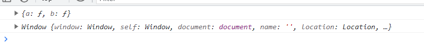

# (JS)2023.06.12

[https://www.notion.so](https://www.notion.so)

# 혼자서 공부하는 자바스크립트(책)

## Day3 - 06 객체

🏁 식별자로 사용할 수 없는 단어를 키로 사용할 경우

- 객체를 생성할 때 키는 식별자와 문자열을 모두 사용할 수 있다. 대부분의 개발자가 식별자를 키로 사용하지만, 식별자로 사용할 수 없는 단어를 키로 사용할 때는 문자열을 사용해야 한다.
- 그리고 식별자가 아닌 문자열을 키로 사용했을 때는 무조건 ***대괄호*** `[ ]` 를 사용해야 객체의 요소에 접근할 수 있다.

```html
<script>
	const object = {
		"with space": 273,
		"with ~!@ #$%^&*()_+": 52
	}

	// 객제의 요소에 접근한다
	object["with space"]
	object["with ~!@ #$%^&*()_+"]
</script>
```

<br>
<br>

### 속성과 메소드

✔️ 요소(element) : 배열 내부에 있는 값

✔️ 속성(property) : 객체 내부에 있는 값

```jsx
const object = {
 number: 273,
 string: '루비',
 boolean: true,
 array: [52, 273, 103, 32],

 method: function() {}
}
```

<br>

- 속성과 메소드 구분하기

객체의 속성 중 함수 자료형인 속성을 메소드(method)라고 부른다

다음 코드에서 객체 person은 name속성과 eat속성을 가지고 있는데, eat 속성처럼 입력값을 받아 무언가 한 다음 결과를 도출해내는 함수 자료형을 특별히 eat() 메소드라고 부른다.

```jsx
const person {
	name: '보연'
	eat: function(food) {}
}

person.eat() // 메소드 호출
```

<br>

- 메소드 내부에서 this 키워드 사용하기

메소드 내에서 자기 자신이 가진 속성을 출력하고 싶을 때는 자신이 가진 속성임을 분명하게 표시해야 한다. 자기 자신이 가진 속성이라는 것을 표시할 때는 this 키워드를 사용한다

```jsx
// 변수 선언
const pet = {
  name: '루비',
  eat: function(food) {
	  alert(this.name + '는 ' + food + '를 먹습니다.')
	}
}
// this 키워드를 사용해 자신이 가진 속성에 접근할 수 있다.

// 메소드 호출
pet.eat('치즈');
```

<br>
<br>

### 동적으로 객체 속성 추가/제거

객체를 처음 생성한 후에 속성을 추가하거나 제거하는 것을 ‘동적으로 속성을 추가한다’ 또는 ‘동적으로 속성을 제거한다’고 표현한다

- 동적으로 객체 속성 추가하기

```jsx
const student = {}
    student.이름 = '김보연'
    student.취미 = '테니스'
    student.장래희망 = '개발자'

    console.log(JSON.stringify(student, null, 2))
```

- 동적으로 객체 속성 삭제하기

```jsx
delete 객체.속성

delete student.취미;
```

<br>
<br>

### 메소드 간단 선언 구문

```jsx
// 변수 선언
const pet = {
  name: '루비',
  eat(food) {
	  alert(this.name + '는 ' + food + '를 먹습니다.')
	}
}

// 메소드 호출
pet.eat('치즈');
```

<br>
<br>

### 화살표 함수를 사용한 메소드

`function() {}`  형태로 선언하는 익명함수와 `() => {}` 형태로 선언하는 화살표 함수는 객체의 메소드로 사용될 때 `this` 키워드를 다루는 방식이 다르다

- this 키워드의 차이

```jsx
const test = {
      a: function() {
        console.log(this)
      },

      b: () => {
        console.log(this)
      }
    }

test.a(); // 현재 코드에서 test 객체 출력
test.b(); // window 객체 출력
```



<aside>
💡 메소드를 만들 때 특별한 이유가 있지 않은 한 화살표 함수를 사용하지 않는다.

</aside>

<br>
<br>

### 🗒️ 정리

✏️ 요소란?

배열 내부에 있는 값

✏️ 속성이란?

객체 내부에 있는 값

✏️ 메소드란?

속성 중에 함수 자료형인 것을 의미한다

✏️ this 란?

객체 내부의 메소드에서 객체 자신을 나타내는 키워드

✏️ 동적 속성 추가, 동적 속성 제거

객체 생성 이후에 속성을 추가하거나 제거하는 것을 말한다.

<br>
<br>

### 💻 확인 문제

1️⃣ 다음과 같은 대상을 자바스크립트 객체로 선언해주세요.

```jsx
const book = {
  name: '혼자 공부하는 자바스크립트',
  price: 18000,
  publisher: '한빛미디어'
}
```

<br>

4️⃣

```jsx
const object = {
      ko: '빵',
      en: 'bread',
      fr: 'pain',
      es: 'pan',

      lang: {
        ko: '한국어',
        en: '영어',
        fr: '프랑스어',
        es: '스페인어'
      },
      print(lang) {
        console.log(`${this.ko}는 ${this.lang[lang]}로 ${this[lang]}입니다.`)
      }
    }

    object.print('es');
```


<br>
<br>
<br>

## 06 - 2 객체의 속성과 메소드 사용하기

### 객체 자료형


<br>

### 기본 자료형

자바스크립트는 `undefined` 와 `null` 이 아닌 것 중에 객체가 아닌 것을 기본자료형(primitive types) 또는 primitives 라고 부른다. 숫자, 문자열, 불이 바로 기본 자료형이다.

이러한 자료형은 객체가 아니므로 속성을 가질 수 없다.


<br>

### 기본 자료형을 객체로 선언하기

자바스크립트는 기본 자료형을 객체로 선언하는 방법을 제공한다.

```jsx
const 객체 = new 객체 자료형 이름()

new Number(10)
new String('안녕하세요')
new Boolean(true)
```

이렇게 사용하면 숫자 객체, 문자열 객체, 불 객체를 생성할 수 있다.

단순한 기본 자료형이 아니므로 이전과 다르게 속성을 가진다. 다음과 같이 new Number()를 사용해서 숫자를 생성하면 숫자와 관련된 연산자도 모두 활용 가능하고, 속성과 메소드를 활용할 수 있다.


- 속성을 가질 수 있다
- 콘솔에서 단순하게 f를 출력하면 객체 형태로 출력된다
- 숫자와 똑같이 활용할 수 있고 valueOf() 메소드를 사용해서 값을 추출할 수도 있다

<br>

### new 키워드를 사용하지 않을 때 주의점

⭐ `new` 키워드를 사용하지 않으면 함수가 자료형 변환 기능으로 작동한다. 


<br>
<br>

### 기본 자료형의 일시적 등급


- 기본 자료형은 속성과 메소드를 가질 수 없다. 그런데 이것이 어떻게 가능한 것일까?
- 자바스크립트는 사용의 편리성을 위해서 기본 자료형의 속성과 메소드를 호출할 때 (기본 자료형 뒤에 온점을 찍고 무언가 하려고 하면) 일시적으로 ***기본 자료형을 객체로 승급***시킨다.
- 이러한 승급은 일시적이다. 따라서 sample 속성에 기본 자료형이 추가되는 것처럼 보였지만, 실제로는 추가되지 않는 현상이 일어난 것.

<br>
<br>

### 프로토타입으로 메소드 추가하기

어떤 객체의 prototype이라는 속성이 바로 객체 전용 옷(틀)이라고 할 수 있다. prototype 객체에 속성과 메소드를 추가하면 모든 객체(와 기본 자료형)에서 해당 속성과 메소드를 사용할 수 있다.

```jsx
객체 자료형 이름.prototype.메소드 이름 = function() {

}
```


- 제곱연산자


<br>

- 프로토타입으로 숫자 메소드 추가하기

```jsx
Number.prototype.power = function(n = 2) {
      return this.valueOf() ** n
    }

    const a = 12
    console.log('a.power(): ', a.power());
    console.log('a.power(3): ', a.power(3));
    console.log('a.power(4): ', a.power(4));
```


✔️ 코드에서 `this.valueOf()` 로 숫자 값을 꺼냈다. 그냥 `this ** n` 을 해도 문제 없이 계산이 되지만, 객체 내부에서 값을 꺼내 쓰는 것임을 명확하게 하기 위해서 `valueOf()` 메소드를 사용하는 것이 일반적이다.

이렇게 프로토타입에 메소드를 추가하면 이를 활용해서 숫자를 제곱할 수 있따. 함수를 생성할 때 기본 매개변수도 사용했다.

<br>

- `indexOf()` : 문자열 내부에 어떤 문자열이 있는지, 배열 내부에 어떤 자료가 있는지 확인할 때 사용하는 메소드.


✔️ 문자열 내에 있는 문자열이라면 그 인덱스를 출력한다

✔️ 문자열 내에 없는 문자열이라면 -1 출력한다

<br>

- 프로토타입으로 문자열 메소드 추가하기

```jsx
String.prototype.contain = function(data) {
      return this.indexOf(data) >= 0
    }

    Array.prototype.contain = function(data) {
      return this.indexOf(data) >= 0
    }

    const a = '안녕하세요';
    console.log('안녕 in 안녕하세요', a.contain('안녕'));
    console.log('없는데 in 안녕하세요', a.contain('없는데'));

    const b = [273, 32, 103, 57, 52];
    console.log('273 in [273, 32, 103, 57, 52]', b.contain(273));
    console.log('0 in [237, 32, 103, 57, 52]', b.contain(0));
```


<br>

<br>

### Number 객체

- 숫자 N번째 자릿수까지 출력하기: `toFixed()`
    - 소수점 아래 2자리까지 출력하고 싶다면 `toFixed(2)` , 3자리까지 출력하고싶다면 `toFixed(3)`


<br>

- `NaN` 과 `Infinity` 확인하기 : `isNaN()` , `isFinite()`

어떤 숫자가 NaN(Not a Number)인지 또는 Infinity(무한)인지 확인할 때는 `Number.isNaN()` 메소드와 `Number.isInfinity()` 메소드 사용. 이 메소드들은 숫자 자료 뒤에 온점을 찍고 사용하는 것이 아니라 Number 뒤에 점을 찍고 사용한다

NaN 과 비교하면 모든 값이 false로 나오므로 isNaN 을 이용해야한다.


[Number - JavaScript | MDN](https://developer.mozilla.org/ko/docs/Web/JavaScript/Reference/Global_Objects/Number)

<br>
<br>

### String 객체

- `trim()` : 문자열 양쪽 끝의 공백 없애기
- `split()` : 문자열을 특정 기호로 자르기

<br>

<br>

### JSON 객체

- 값을 표현할 때는 문자열, 숫자, 불 자료형만 사용할 수 있다.(함수 등은 사용 불가)
- 문자열은 반드시 큰따옴표로 만들어야한다
- 키(key)에도 반드시 따옴표를 붙여야한다.
- 자바스크립트 객체를 JSON 문자열로 변환할 때는 `JSON.stringify()` 메소드 사용

```jsx
const data = [
      {
        name: '혼자 공부하는 자바스크립트',
        price: 18000,
        publisher: '한빛미디어'
      },
      {
        name: 'HTML5 웹 프로그래밍 입문',
        price: 26000,
        publisher: '한빛아카데미'
      }
    ]

    console.log(JSON.stringify(data))
    console.log(JSON.stringify(data, null, 2))
```

✔️ `null` 2번째 매개변수는 객체에서 어떤 속성만 선택해서 추출하고 싶을 떄 사용하나 거의 사용하지 않으며, 일반적으로 null(아무것도 없음)을 넣는다

✔️ `2` 들여쓰기 2칸으로 설정한다.


<br>
<br>

- `JSON.parse()` : JSON 문자열 → 자바스크립트 객체

```jsx
const data = [
      {
        name: '혼자 공부하는 자바스크립트',
        price: 18000,
        publisher: '한빛미디어'
      },
      {
        name: 'HTML5 웹 프로그래밍 입문',
        price: 26000,
        publisher: '한빛아카데미'
      }
    ]
    
    const json = JSON.stringify(data);
    console.log(json)

    console.log(JSON.parse(json))
```


<br>
<br>

### Math 객체

- `Math.random()` 메소드
    - 메소드는 0 이상, 1 미만의 랜덤한 숫자를 생성한다. 0 ≤ 결과  < 1 의 범위만 생성사므로 그 이상의 범위에서 랜덤한 숫자를 구하려면 다양한 처리를 해야한다.

```jsx
const num = Math.random()

    console.log('# 랜덤한 숫자')
    console.log('0 ~ 1 사이의 랜덤한 숫자: ', num)
    console.log('')

    console.log('# 랜덤한 숫자 범위 확대')
    console.log('0 ~ 10 사이의 랜덤한 숫자: ', num * 10)
    console.log('0 ~ 50 사이의 랜덤한 숫자: ', num * 50)
    console.log('')

    console.log('# 랜덤한 숫자 범위 이동')
    console.log('-5 ~ 5 사이의 랜덤한 숫자: ', num * 10 - 5)
    console.log('-25 ~ 25 사이의 랜덤한 숫자: ', num * 50 - 25)
    console.log('')

    console.log('# 랜덤한 정수 숫자')
    console.log('-5 ~ 5 사이의 랜덤한 정수 숫자: ', Math.floor(num * 10 - 5))
    console.log('-25 ~ 25 사이의 랜덤한 정수 숫자: ', Math.floor(num * 50 - 25))
```


<br>
<br>

### 외부 script 파일 읽어오기

```html
// main.html

<!DOCTYPE html>
<html lang="en">
<head>
  <title>Document</title>
  <script src="test.js"></script>
  <script>
    console.log('# main.html의 script 태그');
    console.log('sample 값:', sample)

  </script>
</head>
<body>

</body>
</html>
```

```jsx
// test.js

console.log('# test.js 파일')
const sample = 10
```


<br>
<br>

### Lodash 라이브러리

[Lodash](https://lodash.com)

- `_.sortBy()` 메소드

```jsx
const books = [
      {
        name: '혼자 공부하는 자바스크립트',
        price: 18000,
        publisher: '한빛미디어'
      },
      {
        name: 'HTML5 웹 프로그래밍 입문',
        price: 26000,
        publisher: '한빛아카데미'
      },
      {
        name: '머신러닝 딥러닝 실전 개발 입문',
        price: 30000,
        publisher: '위키북스'
      },
      {
        name: '딥러닝을 위한 수학',
        price: 25000,
        publisher: '위키북스'
      }
    ]

    const output = _.sortBy(books, (book) => book.price)
    console.log(JSON.stringify(output, null, 2))
```

✔️ 코드를 실행하면 가격(price)로 정렬한 결과를 출력한다.


✔️ Lodash 라이브러리는 이외에도 다양한 기능이 있다

- Luxon과 date-fns 처럼 날짜와 시간을 쉽게 다루는 라이브러리
- Handsontable 처럼 웹 페이지에 스프레드시트를 출력하는 라이브러리
- DS.js 와 ChartJS - 그래프
- Three.js - 3차원 그래픽

<aside>
💡 라이브러리를 많이 살펴볼수록 자바스크립트로 할 수 있는 폭이 넓어진다. 또한 라이브러리 코드를 읽어보면 코드를 잘 만드는 사람들이 어떤 식으로 작성하는지도 알 수 있다.
구글에서 “popluar javascript library 2020” 으로 검색하면 다양한 라이브러리들이 나오므로 살펴보기 !!! ⭐

</aside>

<br>
<br>

### 🗒️ 정리

✏️ 기본 자료형

실체가 있는 것 중에서 객체가 아닌 것, 숫자 문자열 불이 대표적인 예이다

✏️ 객체 자료형

객체를 기반으로 하는 자료형, new 키워드를 활용해서 생성한다

✏️ 기본 자료형의 승급

기본 자료형이 일시적으로 객체 자료형으로 변화하는 것을 의미한다

✏️ prototype 객체

객체의 틀을 의미하며, 이곳에 속성과 메소드를 추가하면 해당 객체 전체에서 사용 가능

<br>

<br>

### 💻 확인 문제

2️⃣

```jsx
function printLang(code) {
      return printLang._lang[code]
    }

    printLang._lang = {
      ko: '한국어',
      en: '영어',
      fr: '프랑스어',
      es: '스페인어',
      ja: '일본어',
    }

    console.log('printLang("ko"):', printLang('ko'))
    console.log('printLang("fr"):', printLang('fr'))
```


<br>

5️⃣ Lodash 라이브러리의 `._orderBy()` 메소드를 이용하여 name으로 오름차순 정렬

```jsx
const books = [
      {
        name: '혼자 공부하는 자바스크립트',
        price: 18000,
        publisher: '한빛미디어'
      },
      {
        name: 'HTML5 웹 프로그래밍 입문',
        price: 26000,
        publisher: '한빛아카데미'
      },
      {
        name: '머신러닝 딥러닝 실전 개발 입문',
        price: 30000,
        publisher: '위키북스'
      },
      {
        name: '딥러닝을 위한 수학',
        price: 25000,
        publisher: '위키북스'
      }
    ]

    const output = _.orderBy(books, (book) => book.name)
    console.log(JSON.stringify(output, null, 2))
```


