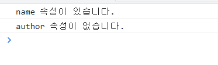

# (JS)2023.06.13

## 06 - 3 객체와 배열 고급

### 속성 존재 여부 확인

🏁 객체 내부에 어떤 속성이 있는지 확인해보는 코드는 굉장히 자주 사용하는 코드이다. 내가 직접 코드를 작성할 때도, 남이 만든 코드를 이해할 때도 필요하다

✔️ 객체에 없는 속성에 접근하면 `undefined` 자료형이 나온다. 따라서 조건문으로 `undefined` 인지 아닌지 확인하면 속성 존재 여부를 확인할 수 있다.

<br>

- 속성 존재 여부 확인하기

```jsx
const object = {
      name: '혼자 공부하는 자바스크립트',
      price: 18000,
      publisher: '한빛미디어'
    }

    if(object.name !== undefined) {
      console.log('name 속성이 있습니다.')
    } else {
      console.log('name 속성이 없습니다.')
    }

    if(object.author !== undefined) {
      console.log('author 속성이 있습니다.')
    } else {
      console.log('author 속성이 없습니다.')
    }
```



- 더 간단한 방법

```jsx
    if(object.name) {
      console.log('name 속성이 있습니다.')
    } else {
      console.log('name 속성이 없습니다.')
    }

    if(object.author) {
      console.log('author 속성이 있습니다.')
    } else {
      console.log('author 속성이 없습니다.')
    }
```

- 더 짧게 사용한다면 ?
    - ⭐ 객체의 특정 속성이 `false` 로 변환될 수 있는 값(0, false, 빈 문자열 등)이 아닐때와 같은 전제가 있어야 안전하게 사용 가능 !

```jsx
object.name || console.log('name 속성이 없습니다.')
object.author || console.log('author 속성이 없습니다.')
```

<br>

- 기본 속성 지정하기
    - 객체의 속성이 있는지 확인하고 있다면 해당 속성을, 없다면 별도의 문자열을 지정하는 코드이다.

```jsx
const object = {
      name: '혼자 공부하는 자바스크립트',
      price: 18000,
      publisher: '한빛미디어'
}

object.name = object.name !== undefined ? object.name : '제목 미정'
object.author = object.author !== undefined ? object.author : '저자 미상'

console.log(JSON.stringify(object, null, 2))
```

- 짧은 조건문

```jsx
object.name = object.name || '제목 미정'
object.author = object.author || '저자 미상'
```

<br>
<br>

### 배열 기반의 다중 할당

```jsx
[식별자, 식별자, 식별자, ...] = 배열
```


- 할당 연산자(=) 왼쪽에 식별자(변수 또는 상수)의 배열을 넣고, 오른쪽에 배열을 위치시키면 배열의 위치에 맞게 값들이 할당된다.
- 배열의 크기는 같을 필요 없음
- const 키워드로도 사용 가능


<aside>
💡 배열 기반의 다중 할당은 자주 사용되는 내용은 아니다. 하지만 이어서 살펴보는 객체 기반의 다중 할당은 많이 사용되는 기능이므로 익숙해지기 !

</aside>

<br>
<br>

### 객체 기반의 다중 할당

객체 내부에 있는 속성을 꺼내서 변수로 할당할 때 다음과 같은 코드를 사용할 수 있다

- 객체 속성 꺼내서 다중 할당하기

```jsx
{ 속성 이름, 속성 이름 } = 객체
{ 식별자 = 속성 이름, 식별자 = 속성 이름 } = 객체
```

```jsx
const { name, price } = object
    console.log('# 속성 이름 그대로 꺼내서 출력하기')
    console.log(name, price);
    console.log('')

    const { a = name, b = price} = object
    console.log('# 다른 이름으로 속성 꺼내서 출력하기')
    console.log(a, b)
```


<br>
<br>

### 배열 전개 연산자

- 전개 연산자를 사용한 배열 복사

```jsx
[...배열]
```

```jsx
const 물건_200301 = ['우유', '식빵']
    const 물건_200302 = [...물건_200301]
    물건_200302.push('고구마')
    물건_200302.push('토마토')

    console.log(물건_200301)
    console.log(물건_200302)
```


<br>

- 전개 연산자를 사용한 배열 요소 추가

```jsx
[...배열, 자료, 자료, 자료]
```

- 전개 연산자로 배열 전개하고 자료 추가하기

```jsx
const 물건_200301 = ['우유', '식빵']
const 물건_200302 = ['고구마', ...물건_200301, '토마토']

console.log(물건_200301)
console.log(물건_200302)
```

- 전개 연산자를 입력한 곳에 배열이 전개되어 들어가는 것뿐이므로 다음과 같이 배열을 여러 번 전개할 수도 있다. 또한 다른 2개 이상의 배열을 붙일 때도 활용 가능하다


<br>
<br>

### 객체 전개 연산자

- 전개 연산자를 사용한 객체 복사

```jsx
{...객체}
```

- 얕은 복사로 객체 복사하기

```jsx
const 루비 = {
      이름: '루비',
      나이: 15,
      종족: '강아지'
    }

    const 김루비 = 루비
    김루비.이름 = '김루비'
    김루비.나이 = 13

    console.log(JSON.stringify(루비))
    console.log(JSON.stringify(김루비))
```


<br>

- 전개 연산자를 사용해 깊은 복사하기

```jsx
const 루비 = {
      이름: '루비',
      나이: 15,
      종족: '강아지'
    }

    const 김루비 = {...루비}
    김루비.이름 = '김루비'
    김루비.나이 = 13

    console.log(JSON.stringify(루비))
    console.log(JSON.stringify(김루비))
```

- 전개 연산자를 사용한 객체 요소 추가

```jsx
{...객체, 자료, 자료, 자료}
```

- 변경하고 싶은 속성만 추가하기

```jsx
const 루비 = {
      이름: '루비',
      나이: 15,
      종족: '강아지'
    }

    const 김루비 = {
      ...루비,
      이름: '김루비',
      종류: '포메라니안',
      예방접종: true
    }

    console.log(JSON.stringify(루비, null, 2))
    console.log(JSON.stringify(김루비, null, 2))
```


<aside>
💡 객체는 전개 순서가 중요하다. 전개라는 이름처럼 전개한 부분에 객체가 펼쳐진다.

</aside>

<br>

- 전개 부분 뒤로 이동하기

```jsx
const 루비 = {
      이름: '루비',
      나이: 15,
      종족: '강아지'
    }

    const 김루비 = {
      이름: '김루비',
      종류: '포메라니안',
      예방접종: true,
      ...루비
    }

    console.log(JSON.stringify(루비, null, 2))
    console.log(JSON.stringify(김루비, null, 2))
```


<br>

<br>

### 🗒️ 정리

✏️ 속성 존재 여부 확인

객체 내부에 어떤 속성이 있는지 확인하는 것. 객체에 없는 속성은 접근하면 `undefined` 가 나오고, 이를 활용하면 된다

✏️ 다중 할당

배열과 객체 하나로 여러 변수에 값을 할당하는 것을 의미

✏️ 얕은 복사(참조 복사)

복사하는 행위가 단순하게 다른 이름을 붙이는 형태로 동작하는 복사

✏️ 깊은 복사

복사 후 두 객체를 완전하게 독립적으로 사용할 수 있는 복사
