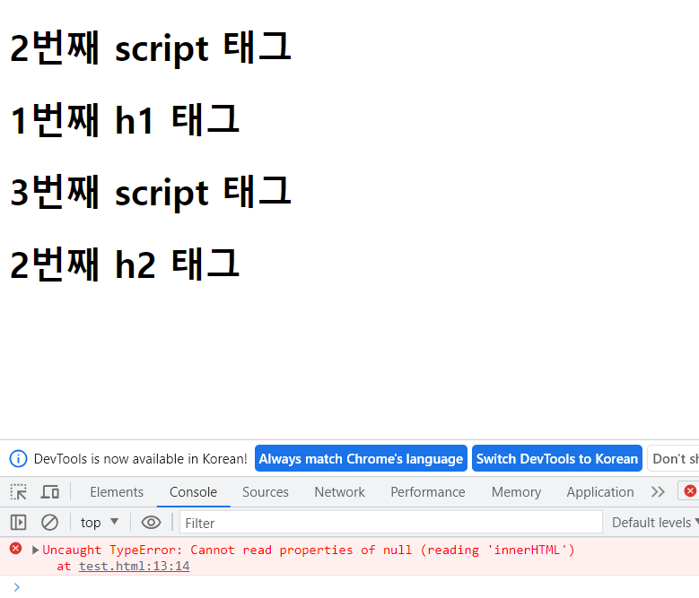

# (JS)2023.06.14

# chapter 07. 문서 객체 모델

### 학습 목표

☑️ DOMContentLoaded 이벤트를 사용하는 이유를 이해한다

☑️ 문서 객체를 가져오거나 생성하는 방법을 이해한다

☑️ 문서 객체를 글자, 속성, 스타일을 조작하는 방법을 이해한다

☑️ 다양한 이벤트의 사용 방법을 이해한다

☑️ 화면에 보이는 애플리케이션을 만드는 방법을 이해한다

<br>
<br>

## 07 - 1 문서 객체 조작하기

HTML 페이지에 있는 `html` , `head`, `body` , `title` , `h1`, `div` , `span` 등을 HTML 언어에서는 요소(element)라고 부른다. 그리고 자바스크립트에서는 이를 문서 객체(document object) 라고 부른다. 따라서 ‘문서 객체를 조작한다’는 말은 ‘HTML 요소들을 조작한다’는 의미이다

⭐ **문서 객체 모델 (DOM, Document Objects Model)** : 문서 객체를 조합해서 만든 전체적인 형태 

<br>

<br>

### DOMContentLoaded 이벤트

문서 객체를 조작할 때는 DOMContentLoaded 이벤트를 사용한다.

코드를 입력할 때 DOMContentLoaded 문자열은 오탈자를 입력해도 오류를 발생시키지 않는다. 주의하기 ! ⭐

```jsx
document.addEventListener('DOMContentLoaded', () => {
      
})
```

<br>

🗒️ 기본적인 실행 순서

- `<!DOCTYPE html>` 이라고 적혀있으므로, HTML5 문서이겠구나.
- `html` 태그가 있으니까 만들어야지
- `head` 태그가 있으니까 만들어야지
- `title` 태그가 있으니 반영해야지
- `body` 태그가 있으니 만들어야지

<br>

- HTML 코드를 자바스크립트로 조작하기

```jsx
<!DOCTYPE html>
<head>
  <meta charset="UTF-8">
  <title>DOMContentLoaded</title>
  <script>
    const h1 = (text) => `<h1>${text}<h1>`
  </script>
  <script>
    document.body.innerHTML += h1('1번째 script 태그')
  </script>
</head>
<body>
  <script>
    document.body.innerHTML += h1('2번째 script 태그')
    </script>
  <h1>1번째 h1 태그</h1>
  <script>
    document.body.innerHTML += h1('3번째 script 태그')
  </script>
  <h1>2번째 h2 태그</h1>
</body>
</html>
```



✔️ 기본적으로는 `head` 태그 내부의 `script` 태그에서 `body` 태그에 있는 문서에 접근하려면 화면에 문서 객체(요소)를 모두 읽어들일 때까지 기다려야 한다

<br>

🏁 `DOMContentLoaded` 이벤트는 웹 브라우저가 문서 객체를 모두 읽고 나서 실행하는 이벤트이다. 다음과 같이 코드를 구성하면 `DOMContentLoaded` 상태가 되었을 때 콜백 함수를 호출한다. 

- DOMContentLoaded

```jsx
<!DOCTYPE html>
<head>
  <meta charset="UTF-8">
  <title>DOMContentLoaded</title>
  <script>
    document.addEventListener('DOMContentLoaded', () => {
      const h1 = (text) => `<h1>${text}</h1>`
      document.body.innerHTML += h1('DOMContentLoaded 이벤트 발생')
    })
  </script
</head>
<body>
 
</body>
</html>
```


✔️ `script`  태그가 `body` 태그 이전에 위치해도 문제없이 코드가 실행된다. 

<br>
<br>

### 문서 객체 가져오기

```jsx
document.head
document.body
document.title
```

- `querySelector()` 메소드

```html
<!DOCTYPE html>
<head>
  <meta charset="UTF-8">
  <title>DOMContentLoaded</title>
  <script>
    document.addEventListener('DOMContentLoaded', () => {
      const header = document.querySelector('h1')

      header.textContent = 'HEADERS'
      header.style.color = 'white'
      header.style.backgroundColor = 'black'
      header.style.padding = '10px'
    })
  </script>

</head>
<body>
<h1></h1>
</body>
</html>
```

✔️ 실제 h1 태그에는 내용을 입력하지 않았지만, 자바스크립트쪽에서 문서 객체를 조작했으므로 코드를 실행하면 위와 같이 출력된다.

<br>
<br>

### 글자 조작하기

```jsx
<!DOCTYPE html>
<head>
  <meta charset="UTF-8">
  <title>DOMContentLoaded</title>
  <script>
    document.addEventListener('DOMContentLoaded', () => {
      const a = document.querySelector('#a')
      const b = document.querySelector('#b')

      a.textContent = '<h1>textContext 속성</h1>'
      b.innerHTML = '<h1>innerHtml 속성</h1>'
    })
  </script>
</head>
<body>
	<div id="a"></div>
	<div id="b"></div>
</body>
</html>
```

### ⭐ `innerText` 대신 `textContent` 사용하기!!

textContent 는 최신 웹 브라우저 또는 익스플로러 9 이후의 웹 브라우저에서 사용할 수 있는 속성이다. 그 이전의 인터넷 익스플로러에서는 innerText 사용했었음. innerText 속성의 성능 문제로 textContent 속성이 추가된 것이므로, 글자 조작 시에는 성능이 좋은 최신의 textContent 속성을 사용하는 것이 좋다 ! 

<br>

<br>

### 속성 조작하기

```jsx
http://placekitten.com/너비/높이
```

```jsx
<!DOCTYPE html>
<head>
  <meta charset="UTF-8">
  <title>DOMContentLoaded</title>
  <script
    document.addEventListener('DOMContentLoaded', () => {
      const rects = document.querySelectorAll('.rect')

      rects.forEach((rect, index) => {
        const width = (index + 1) * 100
        const src = `http://placekitten.com/${width}/250`
        rect.setAttribute('src', src)
      })
    })
  </script>
</head>
<body>
  
  
  
  
</body>
</html>
```


<br>
<br>

### 스타일 조작하기

```jsx
<!DOCTYPE html>
<head>
  <meta charset="UTF-8">
  <title>DOMContentLoaded</title>
  <script>
    document.addEventListener('DOMContentLoaded', () => {
      const divs = document.querySelectorAll('body > div')
      divs.forEach((div, index) => {
        console.log(div, index)
        const val = index * 10
        div.style.height = '10px'
        div.style.backgroundColor = `rgba(${val}, ${val}, ${val})`
      })
    })
  </script>
</head>
<body>
  <div></div><div></div><div></div><div></div><div></div>
  <div></div><div></div><div></div><div></div><div></div>
  <div></div><div></div><div></div><div></div><div></div>
  <div></div><div></div><div></div><div></div><div></div>
  <div></div><div></div><div></div><div></div><div></div>
</body>
</html>
```


<br>
<br>

### 문서 객체 생성하기

```html
<script>
    document.addEventListener('DOMContentLoaded', () => {
      const header = document.createElement('h1')

      header.textContent = '문서 객체 동적으로 생성하기'
      header.setAttribute('data-custom', '사용자 정의 속성')
      header.style.color = 'white'
      header.style.backgroundColor = 'black'

      document.body.appendChild(header)
    })
```


<br>
<br>

### 문서 객체 제거하기

```jsx
부모 객체.removeChild(자식 객체)

문서 객체.parentNode.removeChild(문서 객체)
```

```jsx
<!DOCTYPE html>
<head>
  <meta charset="UTF-8">
  <title>DOMContentLoaded</title>
  <script>
    document.addEventListener('DOMContentLoaded', () => {
        // 문서 객체 제거하기
        setTimeout(() => {
          const h1 = document.querySelector('h1')

          h1.parentNode.removeChild(h1)
          // document.body.removeChile(h1)
        }, 3000)
    })
  </script>
</head>
<body>
  <hr>
  <h1>제거 대상 문서 객체</h1>
  <hr>
</body>
</html>
```


<br>
<br>

### 이벤트 설정하기

`document.addEventListener('DOMContentLoaded', () => {})` 이 코드는 “document라는 문서 객체의 DOMContentLoaded 이벤트가 발생했을 때, 매개변수로 지정한 콜백 함수를 실행해라” 라는 의미이다.

```jsx
문서 객체.addEventListener(이벤트 이름, 콜백 함수)
```

- 이벤트가 발생할 때 실행할 함수를 **이벤트 리스너(event listener)** 또는 **이벤트 핸들러(event handler)** 라고 부른다

<br>

- 이벤트 연결하기

```jsx
<!DOCTYPE html>
<head>
  <meta charset="UTF-8">
  <title>DOMContentLoaded</title>
  <script>
    document.addEventListener('DOMContentLoaded', () => {
        let counter = 0;
        const h1 = document.querySelector('h1')

        h1.addEventListener('click', (event) => {
          counter++
          h1.textContent = `클릭 횟수: ${counter}`
        })
    })
  </script>
<style>
  h1 {
    user-select: none;
  }
</style>
</head>
<body>
  <h1>클릭 횟수: 0</h1>
</body>
</html>
```


✔️ `user-select` 속성을 `none` 으로 지정하면 해당 태그를 마우스로 드래그하지 못한다. h1 태그를 여러 번 클릭할 때 글자가 선택되는 것을 막기 위함이다. 

<br>

- 이벤트 제거

```jsx
문서 객체.removeEventListener(이벤트 이름, 이벤트 리스너)
```

✔️ 이벤트 리스너 부분에는 연결할 때 사용했던 이벤트 리스너를 넣는다. 변수 또는 상수로 이벤트 리스너를 미리 만들고, 이를 이벤트 연결과 연결 제거에 활용한다.

<br>

- 이벤트 연결 제거하기
    - 이벤트 리스너가 여러 번 연결되지 않게 `isConnect` 라는 변수를 활용

```jsx
 <!DOCTYPE html>
<head>
  <meta charset="UTF-8">
  <title>DOMContentLoaded</title>
  <script>
    document.addEventListener('DOMContentLoaded', () => {
        let counter = 0
        let isConnect = false

        const h1 = document.querySelector('h1')
        const p = document.querySelector('p')
        const connectButton = document.querySelector('#connect')
        const disconnectButton = document.querySelector('#disconnect')
    
        const listener = (event) => {
          h1.textContent = `클릭 횟수 : ${++counter}`
        }

        connectButton.addEventListener('click', () => {
          if(isConnect === false) {
            h1.addEventListener('click', listener)
            p.textContent = '이벤트 연결 상태: 연결'
            isConnect = true
          }
        })

        disconnectButton.addEventListener('click', () => {
          if(isConnect === true) {
            h1.removeEventListener('click', listener)
            p.textContent = '이벤트 연결 상태: 해제'
            isConnect = false
          }
        })
    
      })
  </script>
  <!--<script>
    // document.addEventListener('DOMContentLoaded', () => {

    // })

    const h1 = (text) => `<h1>${text}<h1>`
  </script>
  <script>
    document.body.innerHTML += h1('1번째 script 태그')
  </script>
-->
<style>
  h1 {
    /* 클릭을 여러 번 했을 때 글자가 선택되는 것을 막기 위한 스타일*/
    user-select: none;
  }
</style>
</head>
<body>
  <h1>클릭 횟수: 0</h1>
  <button id="connect">이벤트 연결</button>
  <button id="disconnect">이벤트 제거</button>
  <p>이벤트 연결 상태 : 해제</p>
</body>
</html>
```


<br>

<br>

### 🗒️ 정리

✏️ DOMContentLoaded 이벤트란?

HTML 페이지의 모든 문서 객체(요소)를 웹 브라우저가 읽어들였을 때 발생시키는 이벤트이다

✏️ querySelector() 란?

문서 객체를 선택할 때 사용하는 메소드이다

✏️ textContent 속성과 innerHTML 속성이란?

문서 객체 내부의 글자를 조작할 때 사용하는 속성이다

✏️ style 속성이란?

문서 객체의 스타일을 조작할 때 사용하는 속성이다

✏️ 이벤트 리스너(이벤트 핸들러)는 이벤트가 발생할 때 실행하는 함수를 의미한다

<br>
<br>
<br>

## 07 - 2 이벤트 활용

### 이벤트 모델

이벤트를 연결하는 방법을 이벤트 모델 (event model)이라고 부른다

07 - 1 에서는 이벤트를 연결할 때 `addEventListener()`  메소드를 사용했다. 이 방법이 현재 표준으로 사용하고 있는 방법이므로 **표준 이벤트 모델** 이라고 부른다.

```jsx
document.body.addEventListener('keyup', () => {

}
```

과거에는 문서 객체가 갖고 있는 onOO으로 시작하는 속성에 함수를 할당해서 이벤트를 연결했다. 이와 같은 이벤트 연결 방법을 **고전 이벤트 모델** 이라고 부른다.

```jsx
document.body.onkeyup = (event) => {

}
```

그리고 고전 이벤트 모델처럼 onOO으로 시작하는 속성을 HTML 요소에 직접 넣어서 이벤트를 연결하는 것을 **인라인 이벤트 모델** 이라고 부른다.

```jsx
<script>
	const Listener = (event) => {
	}
</script>
<body onkeyup = "listener(event)">
</body>
```

<br>
<br>

### 키보드 이벤트

| 이벤트 | 설명 |
| --- | --- |
| keydown | 키가 눌릴 때 실행. 키보드를 꾹 누르고 있을 때도, 입력될 때도 실행 |
| keypress | 키가 입력되었을 때 실행. |
| keyup | 키보드에서 키가 떨어질 때 수행 |

<aside>
💡 `keydown` , `keypress` 는 웹 브라우저에 따라서 아시아권 문자(한국어, 중국어, 일본어)를 제대로 처리하지 못하는 문제가 있어서 일반적으로는 `keyup` 이벤트 사

</aside>

🏁 IME 입력 문자: 아시아권의 문자를 일반적으로 조합형 문자(IME 입력 문자)라고 부른다. 웹 브라우저에 따라서 keypress 이벤트는 조합 중에 발생하기도, 발생하지 않기도 하는 문제가 있다.

<br>
<br>

- 남은 글자 수 출력하기

```jsx
<script>
	document.addEventListener('DOMContentLoader', () => {
		const textarea = document.querySelector('textarea')
		const h1 = document.querySelector('h1')
		
		textarea.addEventListener('keyup', (event) => {
			const length = textarea.value.length
			h1.textContent = `글자 수: ${length}`
		}
	}
</script>
<body>
	<h1></h1>
	<textarea></textarea>
</body>
```

✔️ textarea 처럼 텍스트를 입력하는 입력 양식의 값은 `value` 속성으로 읽어들인다. 


<br>

### 키보드 키 코드 사용하기

| 이벤트 속성 이름 | 설명 |
| --- | --- |
| code | 입력한 키 |
| keyCode | 입력한 키를 나타내는 숫자 |
| altKey | alt 키를 눌렀는지 |
| ctrlKey | ctrl 키를 눌렀는지 |
| shiftKey | shift 키를 눌렀는지 |

🏁 `code` 속성은 입력한 키를 나타내는 문자열

🏁 `altKey` `ctrlKey` `shiftKey` 속성은 해당 키를 눌렀는지 불 자료형 값 

<br>

- 키보드 이벤트와 관련된 이벤트 속성

```jsx
document.addEventListener('DOMContentLoader', () => {
	const h1 = document.querySelector('h1')
	const print = (event) => {
		let output = ''
		output += `alt: ${event.altKey}<br>`
		output += `ctrl: ${event.ctrlKey}<br>`
		output += `shift: ${event.shiftKey}<br>`
		output += `code: ${typeof(event.code) !== 'undefined' ? event.code : event.keyCode}<br>`
		h1.innerHTML = output
	}

	document.addEventListener('keydown', print)
	document.addEventListener('keyup', print)
}
```


<aside>
💡 페이스북에서 `alt` + 숫자(1, 2, 3, 4, 5, 6, 7)을 입력하면 특정 페이지로 이동한다. 이러한 단축키를 구현할 때 키보드 이벤트 속성을 사용한 것이다.

</aside>

✔️ 코드에서 ‘event.code가 있는 경우’를 확인하는 코드를 사용했는데, 이는 인터넷 익스플로러와 구버전의 엣지 브라우저를 지원하기 위해서이다. 그런데 인터넷 익스플로러와 구 버전의 엣지 웹 브라우저는 code 속성을 지원하지 않는다. 이런 웹 브라우저까지 지원하려면 keyCode 속성을 활용해서 프로그램을 구현해야한다.

- key 속성 값

[Code values for keyboard events - Web APIs | MDN](http://developer.mozilla.org/en-US/docs/Web/API/KeyboardEvent/code/code_values)

- keyCode 속성 값

[KeyboardEvent: keyCode property - Web APIs | MDN](http://developer.mozilla.org/en-US/docs/Web/API/KeyboardEvent/keyCode)

<br>

keyCode 속성은 입력한 키를 숫자로 나타낸다. 37, 38, 39, 40이 방향키 ← ↑ → ↓ 를 나타낸다. 

- 키로 별 움직이기

```jsx
<script>
	document.addEventListener('DOMContentLoaded', () => {
		
		// 별의 초기 설정
		const star = document.querySelector('h1')
		star.style.position = 'absolute'

		// 별의 이동을 출력하는 기능
		let [x, y] = [0, 0]
		const block = 20
		const print = () => {
			star.style.left = `${x * block}px`
			star.style.top = `${y * block}px`
		}
		print()

		const [left, up, right, down] = [37, 38, 39, 40]
		document.body.addEventListener('keydown', (event) => {
			switch(event.keyCode) {
				case left:
					x -= 1
					break;

				case up:
					y -= 1
					break;

				case right:
					x += 1
					break;
			
				case down:
					y += 1
					break;
			}
			print()
		})
	})
</script>
<body>
	<h1>★</h1>
</body>
```

<aside>
💡 한국어 처리 때문에 keyup 이벤트를 많이 사용한다고 했는데, 방향키는 처리 문제가 없으므로 다른 이벤트를 활용해도 된다. 방향키를 사용하는 게임 등을 할 때는 방향키를 꾹 누르고 있을 가능성이 많으므로 keydown 이벤트를 활용했다.

</aside>

🏁 바벨이 기본적인 문법은 변환하지만, code 속성과 keyCode 속성 등까지 변환하지는 못하므로 어떤 속성이 인터넷 익스플로러에서 사용할 수 있는지 없는지는 따로 기억해두어야 한다. 

<br>
<br>

### 이벤트 발생 객체

코드의 규모가 커지면 이벤트 리스너를 외부로 분리하는 경우가 많아진다. 이러한 경우에는 이벤트를 발생시킨 객체(현재 코드의 textarea)에 어떻게 접근할 수 있을까?

1. `event.currentTarget` 속성 사용
- 이것은 `() => {}` 과 `function () {}` 형태 모두 사용 가능
1. `this` 키워드를 사용한다
- 화살표 함수가 아닌 `function () {}` 형태로 함수를 선언한 경우에 사용한다

<br>

<aside>
💡 화살표 함수가 없었던 과거에는 2번째 방법을 많이 사용했다. 하지만 화살표 함수가 등장한 이후로는 2가지 방법 모두 많이 사용하므로 2가지 다 기억해두기 !

</aside>

- `event.currentTarget`

```jsx
const listener = (event) => {
	// event.currentTarget이 textarea 가 된다.
	const length = event.currentTarget.value.length
	h1.textContent = `글자 수: ${length}`
}

document.addEventListener('DOMContentLoader', () => {
	const textarea = document.querySelector('textarea')
  const h1 = document.querySelector('h1')
  textarea.addEventListener('keyup', listener)
}
```

- `this` 키워드

```jsx
const listener = function(event) {
	const length = this.value.length
	h1.textContent = `글자 수: ${length}`
}

document.addEventListener('DOMContentLoaded', () => {
	const textarea = document.querySelector('textarea')
	const h1 = document.querySelector('h1')
	textarea.addEventListener('keyup', listener)
})
```

<br>
<br>

### 글자 입력 양식 이벤트

✔️ 입력 양식(form) : 사용자로부터 어떠한 입력을 받을 때 사용하는 요소 

HTML에서는 `textarea` `input` `button` `select` 태그 등 모두 입력 양식이다 

- 입력 양식을 기반으로 inch를 cm 단위로 변환하는 프로그램

```jsx
<script>
document.addEventListener('DOMContentLoader', () => {
	const input = document.querySelector('input')
  const button = document.querySelector('button')
  const p = document.querySelector('p')

  button.addEventListener('click', () => {
	// 입력을 숫자로 변환
  const inch = Number(input.value)
	// 숫자가 아니라면 바로 리턴
  if(isNaN(inch)) {
	  p.textContent = `숫자를 입력해주세요`
    return
   }

   const cm = inch * 2.54
   p.textContent = `${cm} cm`
  })
}
</script>
<body>
	<input type="text">inch <br>
  <button>계산</button>
  <p></p>
</body>
```

<aside>
💡 `isNaN()` 함수의 결과가 true로 나오는 숫자가 아닌 경우 바로 return 키워드로 리턴해서 이후의 코드를 실행하지 않는다. else 키워드를 사용할 수 있지만, 위와 같이 사용하면 들여쓰기 단계를 하나 줄일 수 있으므로 코드가 깔끔해진다. 자주 사용되는 형태의 코드라서 ***조기 리턴***(early return)이라는 이름이 붙은 패턴이다.

</aside>

<br>
<br>

- 이메일 형식 확인하기

```jsx
<script>
	document.addEventListener('DOMContentLoader', () => {
	const input = document.querySelector('input')
        const p = document.querySelector('p')
        const isEmail = (value) => {
          // 골뱅이를 가지고 있고 && 골뱅이 뒤에 점이 있다면
          return (value.indexOf('@') > 1) && (value.split('@')[1].indexOf('.') > 1)
        }

        input.addEventListener('keyup', (event) => {
          const value = event.currentTarget.value
          if(isEmail(value)) {
            p.style.color = 'green'
            p.textContent = `이메일 형식입니다: ${value}`
          } else {
            p.style.color = 'red'
            p.textContent = `이메일 형식이 아닙니다: ${value}`
          }
        })
      })
</script>
<body>
	<input type="text">
  <p></p>
</body>
```


<aside>
💡 정규 표현식을 배우면 유효성 검사를 더 쉽고 확실하게 구현할 수 있으므로 별도로 공부해보기 !

</aside>

<br>
<br>

### 드롭다운 목록 활용하기

드롭다운 목록은 기본적으로 `select` 태그로 구현한다

```jsx
<script>
	document.addEventListener('DOMContentLoader', () => {
		const select = document.querySelector('select')
		const p = document.querySelector('p')
		
		select.addEventListener('change', (event) => {
			const options = event.currentTarget.options
			const index = event.currentTarget.options.selectedIndex

			// 선택한 option 태그를 추출한다 
			p.textContent = `선택: ${options[index].textContent}`
		}
	}
</script>
<body>
	<select>
		<option>떡볶이</options>
		<option>오뎅</options>
		<option>순대</options>
		<option>튀김</options>
	</select>
	// 기본값으로 나타내기
	<p>`선택: 떡볶이`</p>
</body>
```


✔️ `select` 태그에 `multiple` 속성을 부여하면 ctrl 키 또는 shift 키를 누르고 여러 항목을 선택할 수 있는 선택 상자가 나온다.

<br>

- multiple select 태그

```jsx
<script>
	document.addEventListener('DOMConentLoaded', () => {
		const select = document.querySelector('select')
        const p = document.querySelector('p')

        select.addEventListener('change', (event) => {
          const options = event.currentTarget.options
          const list = []
          for(const option of options) {
            if(option.selected) {
              list.push(option.textContent)
            }
          }
          p.textContent = `선택: ${list.join(',')}`
    })
	})
</script>
<body>
	<select multiple>
    <option>떡볶이</option>
    <option>순대</option>
    <option>튀김</option>
    <option>오뎅</option>
  </select>
  <p></p>
</body>
```


✔️ ctrl 키를 누르고 여러 개의 요소를 선택 

<br>

- cm 단위를 여러 단위로 변환하는 프로그램

```jsx
<script>
	document.addEventListener('DOMContentLoader', () => {
		let 현재값
        let 변환상수 = 10

        const input = document.querySelector('input')
        const select = document.querySelector('select')
        const span = document.querySelector('span')

        const calculate = () => {
          span.textContent = (현재값 * 변환상수).toFixed(2)
        }

        select.addEventListener('change', (event) => {
          const options = event.currentTarget.options
          const index = event.currentTarget.options.selectedIndex

          변환상수 = Number(options[index].value)
          calculate()
        })

        input.addEventListener('keyup', (event) => {
          현재값 = Number(event.currentTarget.value)
          calculate()
        })
	}
</script>
<body>
	<input type="text"> cm =
  <span></span>
  <select>
    <option value="10">mm</option>
    <option value="0.01">m</option>
    <option value="0.393701">inch</option>
  </select>
</body>
```


<br>
<br>

### 체크 박스 활용하기

약관을 읽었는지, SMS 수신 허가, 이메일 수신 허가 등. `checked` 속성 사용

- 체크 박스 활용하기

```jsx
<script>
	document.addEventListener('DOMContentLoader', () => {
		let [timer, timerId] = [0, 0]
		const checkbox = document.querySelector('input')
		const h1 = document.querySelector('h1')

		checkbox.addEventListener('change', (event) => {
			if(event.currentTarget.checked) {
				timerId = setInterval(() => {
					timer += 1
					h1.textContent = `${timer}초`
				}, 1000)
			} else {
				clearInterval(timerId)
			}
		})
	}
</script>
<body>
	<input type="checkbox">
	<span>타이머 활성화</span>
	<h1></h1>
</body>
```


<br>

<br>

### 라디오 버튼 활용하기

체크박스와 마찬가지로 `checked` 속성을 사용한다

```jsx
<script>
	document.addEventListener('DOMContentLoader', () => {
		const output = document.querySelector('#output')
		const current = document.querySelector('[name=pet]')
		
		radios.forEach((radio) => {
			radio.addEventListener('change', (event) => {
				const current = event.currentTarget
				if(current.checked) {
					output.textContent = `좋아하는 애완동물은 ${current.value}이시군요!`
				}
			})
		})
	})
</script>
<body>
	<h3># 좋아하는 애완동물을 선택해주세요</h3>
	<input type="radio" name="pet" value="강아지">
	<span>강아지</span>
	<input type="radio" name="pet" value="고양이">
	<span>고양이</span>
	<input type="radio" name="pet" value="햄스터">
	<span>햄스터</span>
	<input type="radio" name="pet" value="기타">
	<span>기타</span>
	<hr>
	<h3 id="output"></h3>
</body>
```


<aside>
💡 name 속성을 입력하지 않으면 라디오 버튼을 여러개 선택할 수 있다. 카테고리 구분 없이 선택할 수 있으며, 한 번 선택하고 나면 선택을 취소할 수도 없다. 따라서 라디오 버튼 사용 시, `name` 속성과 함께 사용하는 것을 잊지 말기!!! ⭐⭐

</aside>

<br>
<br>

### 기본 이벤트 막기

✔️ 기본 이벤트 : 어떤 이벤트가 발생했을 때 웹 브라우저가 기본적으로 처리해주는 것

기본 이벤트 제거 시 event 객체의 `preventDefault()` 메소드 사용

<br>

- 이미지 마우스 오른쪽 버튼 클릭 막기

```jsx
<script>
	document.addEventListener('DOMContentLoader', () => {
		const imgs = document.querySeletorAll('img')
		
		imgs.forEach((img) => {
			img.addEventListener('contextmenu', (event) => [
				event.preventDefault()
		}
	}
</script>
<body>
	
</body>
```

✔️ `contextmenu` 이벤트는 기본적으로 앞의 그림과 같은 컨텍스트 메뉴를 출력하는데, 이를 막으면 이미지에서 마우스 오른쪽 버튼을 클릭해도 아무 반응이 없다.
