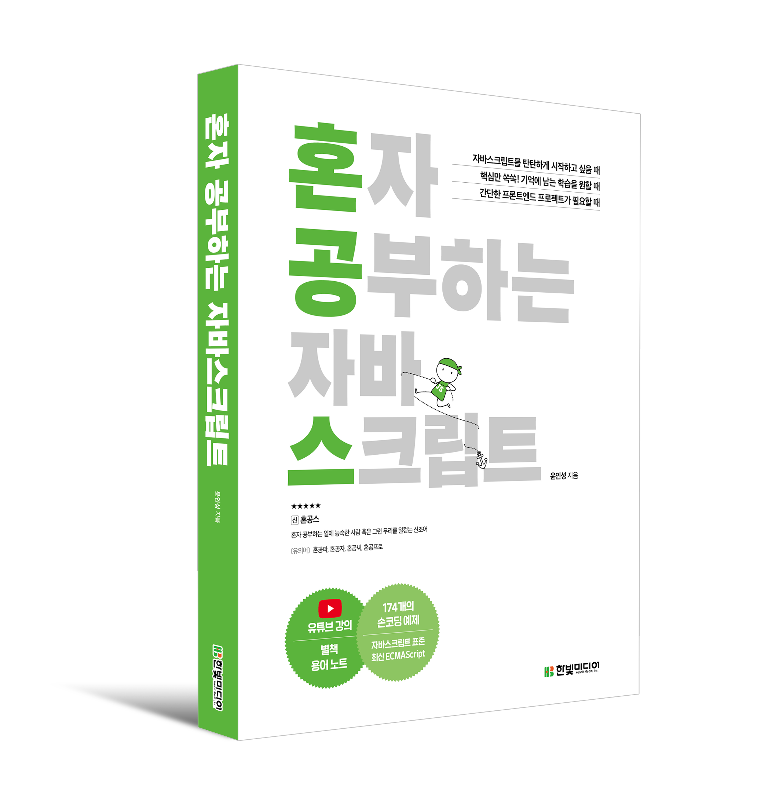

# JavaScript

## 📖 혼자 공부하는 자바스크립트

 
 

### 📋 목차
chapter 01 . 자바스크립트 개요와 개발환경 설정
- 자바스크립트의 활용 ✅
- 개발환경 설치와 코드 실행 ✅
- 알아두어야 할 기본 용어 ✅

 

chapter 02 . 변수
- 기본 자료형 ✅
- 상수와 변수 ✅
- 자료형 변환 ✅

 

chapter 03 . 조건문
- if 조건문 ✅
- switch 조건문과 짧은 조건문 ✅

 

chapter 04 . 반복문
- 배열 ✅
- 반복문 ✅

 

chapter 05 . 함수
- 함수의 기본 형태 ✅
- 함수 고급

 

chapter 06 . 객체
- 객체의 기본
- 객체의 속성과 메소드 사용하기
- 객체와 배열 고급

 

chapter 07 . 문서 객체 모델
- 문서 객체 조작하기
- 이벤트 활용

 

chapter 08 . 예외 처리
- 구문 오류와 예외
- 예외 처리 고급

 

chapter 09 . 클래스
- 클래스의 기본 기능
- 클래스의 고급 기능

 

chapter 10 . 리액트 라이브러리 맛보기
- 리액트의 기본
- 리액트와 데이터
