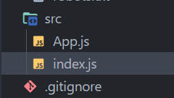

# (React)2023.06.18

## chapter 04 . 리액트 기본

### 4 - 1 리액트 개발 시작하기

- CodeSandbox

[CodeSandbox: Code, Review and Deploy in Record Time](https://codesandbox.io/)

웹 편집기에서 간단하게 자바스크립트 프로젝트를 만들 수 있고 코딩이나 공유, 깃허브와 연동 가능한 서비스. 본격적인 서비스를 개발하는 데는 사용할 수 없지만 개인 학습이나 코드 공유에는 최적의 사이트이다. 환경 구축에 시간을 들이고 싶지 않거나 학습 자체에 우선 집중하고 싶은 사람에게 추천

<aside>
💡 [Start coding for free] → [Create Sandbox] → [React]

</aside>

<br>

- Create React App

```jsx
// 리액트 프로젝트를 작성하는 명령어, my-app이라는 이름의 리액트 프로젝트를 만드는 경우
npx create-react-app [프로젝트 명]
(ex. npx create-react-app my-app)

// 로컬 환경에서 명령어 실행
cd my-app
npm start

// 이 명령어를 실행한 뒤 웹 브라우저에서 http://localhost:3000/ 에 접속하
```

<br>
<br>

### 4 - 2 JSX 표기법

리액트는 JSX 표기법을 사용한다. 자바스크립트 파일 안에서 HTML과 같은 태그를 기술할 수 있다.

- ReactDom import

```jsx
import ReactDOM from "react-dom";
```

- 함수 정의

```jsx
const App = () => {
	return null;
}
```

- 인수 지정

```jsx
ReactDOM.render(<App />, document.getElementById("root"));
```

✔️ ReactDom은 render 라는 함수를 제공한다. 첫 번째 인수에 ‘render 대상’, 두 번째 인수에 ‘render 위치’를 지정한다.

✔️ 첫 번째 인수가 `<App  />` 으로 지정되어 있음. 리액트에서는 함수명을 HTML과 같이 태그로 감싸서 컴포넌트로 다룰 수 있다. 두 번째 인수는 root라는 id를 지정했다. 이것은 public > index.html에 있는 div 태그를 가리킨다 

<br>

- 지정된 `div` 태그

```jsx
<body>
	<div id="root"></div>
</body>
```

⭐ SPA에서 HTML 파일은 한 개뿐이므로 예제와 같이 애플리케이션 루트에 ‘HTML 중 여기에 컴포넌트를 렌더링하라’고 지정한다. 지금은 App 함수가 null을 반환할 뿐이므로 화면은 하얗게 보일 것이다. 

<br>

- h1 태그로 문자 표시

```jsx
import ReactDOM from "react-dom";

const App = () => {
  return <h1>안녕하세요!</h1>;
}

ReactDOM.render(<App />, document.getElementById("root"));
```

✔️ 이제 화면에 안녕하세요! 라고 표시될 것이다. 이렇게 JSX 표기법에서는 함수의 반환값으로 HTML 태그를 기술할 수 있고 그것을 컴포넌트로 다뤄 화면을 구성한다. 

<br>

<br>

### JSX 규칙

- return 이후 행이 여럿일 때는 `( )`로 감싼다.
- ⭐ return 이후는 한 개의 태그로 둘러싸여 있어야 함! (`<div>` 태그 등으로 바깥쪽으로 한 번 감싸기 등)

```jsx
import ReactDOM from "react-dom";

const App = () => {
  return (
    <div>
      <h1>안녕하세요!</h1>
      <p>잘 지내시죠?</p>
    </div>
  );
};

ReactDOM.render(<App />, document.getElementById("root"));
```

- 또한 리액트에서 제공하는 `Fragment` 사용 가능한 두 가지 방법.
    - `Fragment` import 해서 사용하거나
    - 빈 태그로 감싸면 된다.
    
    ```jsx
    // Fragment 사용
    import { Fragment } from "react";
    import ReactDOM from "react-dom";
    
    const App = () => {
      return (
        <Fragment>
          <h1>안녕하세요!</h1>
          <p>잘 지내시죠?</p>
        </Fragment>
      );
    };
    
    ReactDOM.render(<App />, document.getElementById("root"));
    ```
    
    ```jsx
    // 생략 표기법(빈 태그) 사용
    import ReactDOM from "react-dom";
    
    const App = () => {
      return (
        <>
          <h1>안녕하세요!</h1>
          <p>잘 지내시죠?</p>
        </>
      );
    };
    
    ReactDOM.render(<App />, document.getElementById("root"));
    ```
    
    ✔️ `div` 태그와 달리 이 표기법들은 불필요한 DOM을 생성하지 않는다. 따라서 에러를 피하기 위해 바깥쪽을 감싸고 싶은 경우 등에 효과적
    
    <br>
    <br>
    

### 4 - 3 컴포넌트 사용 방법

지금까지 index.js에 코드를 작성했다. 그러나 계속해서 화면과 관련된 코드를 모두 index.js에 작성하면 코드양이 기하급수적으로 늘어나게 된다. 리액트 개발에서는 기본적으로 화면 요소를 다양한 수준의 컴포넌트로 분할함으로써 재사용성과 유지보수성을 높인다. 

<aside>
💡 **컴포넌트의 종류**
함수로 정의된 컴포넌트를 **함수 컴포넌트**라고 부른다.
과거의 리액트에서는 Class로 정의된 **클래스 컴포넌트**도 사용했지만 현재는 함수 컴포넌트가 주류이다.
신규 개발에서는 클래스 컴포넌트를 사용하지 않는다.

</aside>

- 컴포넌트 분할

```jsx
// App.js

export const App = () => {
  return (
    <>
      <h1>안녕하세요!</h1>
      <p>잘 지내시죠?</p>
    </>
  );
}
```

✔️ 이 상태로는 함수 컴포넌트를 이 파일 안에서만 사용할 수 있으므로 다른 파일에서도 사용할 수 있도록 `export` 해야 함.

✔️ `export` 한 것을 `import` 하면 다른 파일 안에서도 사용할 수 있으므로 다음과 같이 작성

```jsx
// index.js

import ReactDOM from "react-dom";
import { App } from "./App";

ReactDOM.render(<App />, document.getElementById("root"));
```

✔️ 같은 계층에 있는 App.js로부터 App이라는 이름의 함수 컴포넌트를 읽었을 때는 이와 같이 작성한다. 확장자는 생략 가능. 화면 표시는 변경하지 않고 컴포넌트화에 성공. 이렇게 각 파일에 컴포넌트를 정의하고 다른 파일에서 읽어 부품을 조합하는 것처럼 화면을 만들어가는 것이 리액트 개발의 묘미 중 하나이다.

<br>

- 컴포넌트 파일의 확장자




리액트 내부에서는 자바스크립트가 움직이고 있는 것이기 때문에 지금까지와 마찬가지로 `.js`라는 확장자로 작동시킬 수 있다. 이외에 컴포넌트용 `.jsx` 확장자도 사용 가능. 

<aside>
💡 선호도나 프로젝트에 따른 규칙은 있으나, 기본적으로 컴포넌트 파일의 확장자는 `.jsx` 를 사용할 것을 권장한다. 컴포넌트인지 js 파일인지 한 눈에 알 수 있고 확장자를 `.jsx` 로 함으로써 편집기의 편리한 보완 기능을 활용할 수 있다.

</aside>

<br>

<br>

### 4 - 4 이벤트와 스타일

### 이벤트 취급 방법

- 버튼 작성

```jsx
export const App = () => {
  return (
    <>
      <h1>안녕하세요!</h1>
      <p>잘 지내시죠?</p>
      <button>버튼</button>
    </>
  );
}
```

⭐ 리액트에서는 이벤트 등을 캐멀 케이스로 작성

⭐ JSX에 작성되어 있는 HTML과 같은 태그 안(return 이후 등)에서는 `{ }` 로 감싸서 자바스크립트를 작성

- 태그 안 작성 방법

```jsx
export const App = () => {
  return (
    <>
      {console.log("TEST")}
      <h1>안녕하세요!</h1>
      <p>잘 지내시죠?</p>
      <button>버튼</button>
    </>
  );
}
```

<br>

- alert 기능 구현

```jsx
export const App = () => {
  // 버튼 클릭 시 실행되는 함수 정의
  const onClickButton = () => {
    alert();
  }

  return (
    <>
      {console.log("TEST")}
      <h1>안녕하세요!</h1>
      <p>잘 지내시죠?</p>
      <button onClick={onClickButton}>버튼</button>
    </>
  );
}
```

<br>

### 스타일 취급 방법

일반적인 HTML/CSS와 마찬가지고 리액트에서도 각 태그에 style 속성을 기술해 스타일 적용 가능함. 단, CSS의 각 요소는 자바스크립트 객체로 기술하는 점에 주의! 

- 글자 색을 빨간색으로 변경

```jsx
export const App = () => {
  // 버튼 클릭 시 실행되는 함수 정의
  const onClickButton = () => {
    alert();
  }

  return (
    <>
      {console.log("TEST")}
      <h1 style={{ color: "red" }}>안녕하세요!</h1>
      <p>잘 지내시죠?</p>
      <button onClick={onClickButton}>버튼</button>
    </>
  );
}
```

✔️ `style={ }` 과 같이 중괄호로 감싸고 그 안에 객체로 CSS에 대응하는 요소를 지정하기 때문에 `style={{ }}` 과 같은 코드가 된다. 

✔️ 객체에서 CSS를 지정하는 방법은 속성명에 CSS 이름을 입력하고 값을 지정하면 된다. 자바스크립트 객체이므로 값은 red가 아니라 “red”로 입력해야 함! `style={{ color: "red" }}` 

⭐ 자바스크립트의 객체로 지정할 수 있으므로 사전에 정의해둔 함수를 할당할 수도 있다.

- p 태그의 글자 색과 크기 변경

```jsx
export const App = () => {
  // 생략..

  // CSS 객체
  const contentStyle= {
    color: "blue",
    fontSize: "20px"
  }

  return (
    <>
      {console.log("TEST")}
      <h1 style={{ color: "red" }}>안녕하세요!</h1>
      <p style={contentStyle}>잘 지내시죠?</p>
      <button onClick={onClickButton}>버튼</button>
    </>
  );
}
```

⭐ font-size 가 아니라 `fontSize` 사용. 자바스크립트 객체 속성명에는 `-(하이픈)` 을 허용하지 않으므로 이벤트처럼 CSS 속성명 역시 모두 캐멀 케이스로 작성

<br>
<br>

### 4 - 5 Props

### Props

Props는 컴포넌트에 전달하는 인수와 같은 것으로, 컴포넌트는 전달받은 Props에 따라 표시하는 스타일과 내용을 변경한다.

<br>

### Props 학습 준비

앞에서 작성한 코드에 분홍색 글자를 추가

```jsx
export const App = () => {
  // 생략...

  // 분홍색 용으로 추가
  const contentPinkStyle = {
    color: "pink",
    fontSize: "20px"
  }

  return (
    <>
      {console.log("TEST")}
      <h1 style={{ color: "red" }}>안녕하세요!</h1>
      <p style={contentStyle}>잘 지내시죠?</p>
      <p style={contentPinkStyle}>잘 지냅니다!</p>
      <button onClick={onClickButton}>버튼</button>
    </>
  );
}
```

✔️ 이렇게 작성하면 구현은 되지만 비슷한 style을 작성하는 일은 번거롭고 쓸데없이 코드만 길어지는 결과를 가져온다. 이에 대응하는 방법은 색상과 텍스트를 Props로 전달해서 색을 입힌 문자열을 반환하는 컴포넌트를 작성하는 것.

✔️ ColoredMessage 라는 이름으로 컴포넌트를 만들고, 먼저 파란색으로 ‘잘 지내시죠?’ 라고 고정된 출력이 표시되도록 구현해보자.(components라는 폴더 안에 저장됨.)

```jsx
// ColoredMessage.jsx

export const ColoredMessage = () => {
  const ContentStyle = {
    color: "blue",
    fontSize: "20px"
  };

  return <p style={ContentStyle}>잘 지내시죠?</p>
}
```

- ColoredMessage 임포트

```jsx
// App.jsx

import { ColoredMessage } from "./components/ColoredMessage";

export const App = () => {
  // 버튼 클릭 시 실행되는 함수 정의
  const onClickButton = () => {
    alert();
  }

  // 분홍색 용으로 추가
  const contentPinkStyle = {
    color: "pink",
    fontSize: "20px"
  }

  return (
    <>
      {console.log("TEST")}
      <h1 style={{ color: "red" }}>안녕하세요!</h1>
      {/* <p style={contentStyle}>잘 지내시죠?</p> */}
      <ColoredMessage />
      <p style={contentPinkStyle}>잘 지냅니다!</p>
      <button onClick={onClickButton}>버튼</button>
    </>
  );
}
```

<br>

### Props 사용 방법

Props를 사용하려면 Props 를 전달하는 쪽의 컴포넌트(App.jsx)와 전달받는 쪽의 컴포넌트(ColoredMessage.jsx) 모두 수정해야 함.

```jsx
// App.jsx

import { ColoredMessage } from "./components/ColoredMessage";

export const App = () => {
  // 생략...
  return (
    <>
      {console.log("TEST")}
      <h1 style={{ color: "red" }}>안녕하세요!</h1>
      <ColoredMessage color="blue" message="잘 지내시죠?" />
      <p style={contentPinkStyle}>잘 지냅니다!</p>
      <button onClick={onClickButton}>버튼</button>
    </>
  );
}
```

- Props를 객체로 받음

```jsx
// ColoredMessage.jsx

export const ColoredMessage = (props) => {
  console.log(props);
  const ContentStyle = {
    color: "blue",
    fontSize: "20px"
  };

  return <p style={ContentStyle}>잘 지내시죠?</p>
}
```

- Props를 사용할 수 있는 형태로 변경

```jsx
export const ColoredMessage = (props) => {
  const ContentStyle = {
    color: props.color,
    fontSize: "20px"
  };

  return <p style={ContentStyle}>{props.message}</p>;
}
```

⭐ JSX 안에서 자바스크립트를 기술하므로 `{ }` 로 감싸는 것에 주의한다

<br>

- 화면 표시 확인

```jsx
import { ColoredMessage } from "./components/ColoredMessage";

export const App = () => {
  // 버튼 클릭 시 실행되는 함수 정의
  const onClickButton = () => {
    alert();
  }

  return (
    <>
      {console.log("TEST")}
      <h1 style={{ color: "red" }}>안녕하세요!</h1>
      <ColoredMessage color="blue" message="잘 지내시죠?" />
      <ColoredMessage color="pink" message="잘 지냅니다!" />
      <button onClick={onClickButton}>버튼</button>
    </>
  );
}
```

<br>

<br>

### children

- children 설정

```jsx
// children이 설정되지 않음
<ColoredMessage />

// children으로 boyeonkim을 설정
<ColoredMessage>boyeonkim</ColoredMessage>
```

✔️ ColoredMessage는 일반적으로 p 태그처럼 사용 가능하며 다른 사람이 코드를 확인할 때 더욱 이해하기가 쉽다. 

<br>

- 텍스트를 children으로 전달

```jsx
// App.jsx
// 생략...

return (
    <>
      {console.log("TEST")}
      <h1 style={{ color: "red" }}>안녕하세요!</h1>
      <ColoredMessage color="blue">잘 지내시죠?</ColoredMessage>
      <ColoredMessage color="pink">잘 지냅니다!</ColoredMessage>
      <button onClick={onClickButton}>버튼</button>
    </>
  );
```

- children으로 메시지 받기

```jsx
// ColoredMessage.jsx

export const ColoredMessage = (props) => {
  const ContentStyle = {
    color: props.color,
    fontSize: "20px"
  };

  return <p style={ContentStyle}>{props.children}</p>
}
```

✔️ 이제 텍스트 메시지는 children을 사용해 전달할 수 있게 되었다. 또한 children은 이렇게 간단한 문자는 물론 다음과 같이 태그로 감싼 요소를 묶어서 전달할 수도 있다.

<br>

- children에 큰 요소를 전달

```jsx
<SomeComponent>
	<div>
		<span>boyeon</span>
		<p>kim</p>
	</div>
</SomeComponent>

// SomeComponent의 children에는 다음을 전달
<div>
	<span>boyeon</span>
	<p>kim</p>
</div>
```

<br>
<br>

### Props를 다루는 기술

처음 단계에서 Props를 분할 대입해두면 코드를 간략하게 만들 수 있다.

- Props 분할 대입

```jsx
// ColoredMessage.jsx

export const ColoredMessage = (props) => {
  // Props 분할 대입
  const { color, children } = props;

  const ContentStyle = {
    color: color, // props. 불필요
    fontSize: "20px"
  };

  return <p style={ContentStyle}>{children}</p>
}
```

- 생략 표기법 규칙에 따라 작성

```jsx
export const ColoredMessage = (props) => {
  // Props 분할 대입
  const { color, children } = props;

  const ContentStyle = {
    color,
    fontSize: "20px"
  };

  return <p style={ContentStyle}>{children}</p>
}
```

- 인수 단계에서 전개하는 패턴

```jsx
// 인수의 ( ) 단계에서 분할 대입
export const ColoredMessage = ({ color, children }) => {

  const ContentStyle = {
    color,
    fontSize: "20px"
  };

  return <p style={ContentStyle}>{children}</p>
}
```

<aside>
💡 Props를 destructure 한다 ⇒ 분할 대입(destructuring assignment) 여부

</aside>

<br>
<br>

### 4 - 6 State(useState)

리액트 개발에서는 화면에 표시하는 데이터나 길이가 변하는 상태 등을 모두 `State`로 관리한다.  가장 중요한 내용이니 확실히 익히기!!! ⭐⭐⭐

<br>

### State

컴포넌트의 상태를 나타내는 값.

- 에러가 있는가?
- 모달 창을 열고 있는가?
- 버튼을 클릭했는가?
- 텍스트 박스에 무언가를 입력했는가?

✔️ 이와 같이 ‘상태’는 모두 State로 관리하며 이벤트가 실행되는 경우 등에 업데이트 처리를 수행함으로써 동적 애플리케이션을 구현한다. 

<br>

### useState

현재 주류인 함수 컴포넌트에서는 리액트 훅(React Hook)으로 통칭되는 기능들 중 `useState` 라는 함수를 사용해 State를 다룬다. `useState` 는 리액트 안에서 제공되므로 사용할 때는 import 해야함.

```jsx
import { useState } from "react";
```

그리고 useState 함수 반환값은 배열 형태로 첫 번째에 State 변수, 두 번째에 그 State를 업데이트하기 위한 함수가 설정된다.

```jsx
const [num, setNum] = useState();
```

<aside>
💡 명칭은 자유롭게 붙일 수 있지만, 암묵적인 규칙을 적용해 변수명이 `num`이라면 업데이트 함수명은 `setNum` 과 같이 붙인다.

</aside>

✔️ 예제에서 num의 초깃값은 undefined 이지만 State 변수에 초깃값을 설정하는 경우도 많다. 그때는 useState 함수를 실행할 때 인수를 지정한다.

- State 초깃값 설정 방법

```jsx
const [num, setNum] = useState(0);
```

<br>

- 카운트업 기능 구현

```jsx
import { ColoredMessage } from "./components/ColoredMessage";
import { useState } from "react";

export const App = () => {
  // State 정의
  const [num, setNum] = useState(0);

  // 버튼 클릭 시 실행되는 함수 정의
  const onClickButton = () => {
    setNum(num + 1);
  }

  return (
    <>
      {console.log("TEST")}
      <h1 style={{ color: "red" }}>안녕하세요!</h1>
      <ColoredMessage color="blue">잘 지내시죠?</ColoredMessage>
      <ColoredMessage color="pink">잘 지냅니다!</ColoredMessage>
      <button onClick={onClickButton}>버튼</button>
      <p>{num}</p>
    </>
  );
}
```


<aside>
💡 `useState` 업데이트 함수 안의 함수
방금 예제에서 `setNum(num + 1)` 써서 카운트업을 구현했지만 엄밀하게 따지면 바른 방법이 아니다. 현재 State 값에 따라 State를 업데이트 할 때는 set 함수 안에서 함수를 지정하는 것이 좋음.

⭐ set 함수 안에서의 함수 지정
`setNum((prev) ⇒ prev + 1);`

</aside>

<br>
<br>

### 4 - 7 재렌더링과 부작용(useEffect)

### 재렌더링

버튼을 클릭해서 State를 카운트업했을 때, 화면을 새로고침하지 않았는데도 수치가 바뀌고 화면 표시가 업데이트 되었을 것이다. 이는 컴포넌트가 재렌더링 되었기 때문.

✔️ **변경을 감지하고 컴포넌트를 다시 처리**하는 것을 재렌더링이라고 부른다.

<aside>
💡 매번 컴포넌트를 처음부터 실행한다 하더라도 맨 처음의 렌더링(컴포넌트의 마운트)과 재렌더링은 다르다. useState의 괄호로 설정한 초깃값은 마운트 시에만 적용되며 매번 초기화되지는 않는다.

</aside>

⭐ State 업데이트 시 컴포넌트가 재렌더링되어 함수 컴포넌트가 다시 처음부터 실행된다!! 는 것 기억하기 

<br>

### 부작용과 useEffect

`useEffect` 는 컴포넌트의 부작용을 제어하는 기능

```jsx
// useEffect 초깃값 설정 방법
import { useEffect } from "react";

// useEffect 선언
useEffect(실행하는 함수[, 의존하는 값]);
```

✔️ 어떤 값이 변했을 때에 한해서만 어떤 처리를 실행하는 기능.

예를 들어 num이라는 State의 값이 변했을 때만 경고를 표시하고 싶은 경우에 다음과 같이 작성.

- State의 값이 변했을 때만 경고 표시

```jsx
export const App = () => {
	useEffect(() => {
		alert();
	}, [num]);

	return (
		// 생략..
	);
});
```

✔️ 첫 번째 인수에는 ***화살표 함수***로 처리를 기술하고 두 번째 인수는 반드시 ***배열***로 지정한다. 여럿을 지정할 때는 [num1, num2]와 같이 기술.

✔️ `useEffect` 는 의존 배열에 지정한 값이 변했을 때와 더불어 컴포넌트 마운트 시(가장 처음)에도 반드시 실행된다는 점에 주의해야 함. 그러므로 useEffect의 두 번째 인수에 `[]` 를 지정하면 ‘가장 처음 컴포넌트를 표시할 때만 실행되는 처리’ 를 의미한다. 화면을 표시하고 초기 데이터를 얻을 때 등에 자주 사용. 

<aside>
💡 이런 기능이 존재하는 이유는 컴포넌트가 재렌더링을 몇 번이고 반복하기 때문. State 수가 많아지만 재렌더링 횟수도 늘어남. 따라서 재렌더링할 때마다 처리를 실행하는 것은 비용(시간)을 낭비하게 되므로 값이 변했을 때만 실행하고 싶은 경우가 생긴다. 이런 부작용을 제어하고자 할 때 useEffect 사용.

</aside>

<br>
<br>

### 4 - 8 export 종류

- normal export

```jsx
// export 측
export const SomeComponent = () => {};

// import 측
import { SomeComponent } from "./SomeComponent";
```

- default export

```jsx
// export 측
const SomeComponent = () => {};
export default SomeComponent;

// import 측
import SomeComponent from "./SomeComponent";
```

⭐ default export는 파일 한 개에서 한 번만 사용 가능하다. 따라서 해당 파일의 내용을 모두 모아서 export 하는 경우에 사용함. 

<aside>
💡 어느 쪽을 사용해도 문제는 없지만 기본적으로 리액트 컴포넌트에서는 normal export를 사용하는 것이 좋다. default export 시 명칭을 잘못 입력하고도 알아채지 못하거나, 의도하지 않은 것을 import할 가능성이 있기 때문.

</aside>

```jsx
// Some이라는 이름으로 컴포넌트를 사용할 수 있다.
import { SomeComponent as Some } from "./SomeComponent";
```

<br>
<br>

### 4 - 9 정리

- 리액트(JSX) 규칙
    - return 이후는 태그 하나로 감싼다
    - 이벤트나 스타일은 캐멀 케이스로 기술한다
    - return 이후에 자바스크립트 코드를 쓸 때는 `{ }` 를 사용한다
- 함수로 ‘컴포넌트’를 만들고 조합해서 화면을 만든다
- 컴포넌트에 전달하는 인수와 같은 값을 Props라 부른다
- 컴포넌트가 가진 다양한 상태를 State라 부른다
- 재렌더링하면 컴포넌트 처음부터 다시 코드가 실행된다
- 두 개의 리액트 훅을 기억하자
    - `useState`
    - `useEffect`
- 두 export의 차이를 파악하자.
