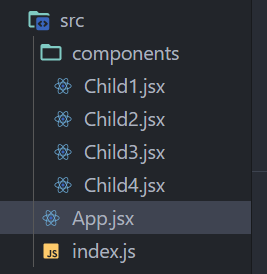

# (React)2023.06.20

## chapter 06 . 재렌더링 구조와 최적화

### 6 - 1 재렌더링이 발생하는 조건

1. State가 업데이트된 컴포넌트
    1. State는 컴포넌트 상태를 나타내는 변수이다. 업데이트될 때 재렌더링되지 않으면 화면 표시를 올바르게 저장할 수 없다. 카운트업 변수를 실행해서 State를 변경하면 화면에 변경한 값이 실시간으로 반영되는 것은 State가 업데이트됨에 따라 컴포넌트가 재렌더링되기 때문.
2. Props가 변경된 컴포넌트
    1. Props를 인수로 받고 그에 대응해 렌더링 내용을 결정하므로 Props 값이 변할 때는 재렌더링해서 출력 내용을 변경해야 한다. 따라서 Props 값이 변할 때는 반드시 재렌더링을 한다. 
3. 재렌더링된 컴포넌트 아래의 모든 컴포넌트

<br>

<br>

### 6 - 2 렌더링 최적화 1(memo)



```jsx
// App.jsx

import { useState } from "react";
import { Child1 } from "./components/Child1";
import { Child4 } from "./components/Child4";

export const App = () => {
  console.log("App 렌더링");

  const [num, setNum] = useState(0);

  const onClickButton = () => {
    setNum(num + 1);
  }

  return (
    <>
      <button onClick={onClickButton}>버튼</button>
      <p>{num}</p>
      <Child1 />
      <Child4 />
    </>
  )
}
```

```jsx
// Child1.jsx

import { Child2 } from "./Child2";
import { Child3 } from "./Child3";

const style = {
  height: "200px",
  backgroundColor: "lightblue",
  padding: "8px"
}

export const Child1 = () => {
  console.log("Child1 렌더링");

  return (
    <div style={style}>
      <p>Child1</p>
      <Child2 />
      <Child3 />
    </div>
  );
};
```

```jsx
// Child2.jsx

const style = {
  height: "50px",
  backgroundColor: "lightgray"
}

export const Child2 = () => {
  console.log("Child2 렌더링");

  return (
    <div style={style}>
      <p>Child2</p>
    </div>
  );
};
```

```jsx
// Child3.jsx

const style = {
  height: "50px",
  backgroundColor: "lightgray"
}

export const Child3 = () => {
  console.log("Child3 렌더링");

  return (
    <div style={style}>
      <p>Child3</p>
    </div>
  );
};
```

```jsx
// Child4.jsx

const style = {
  height: "200px",
  backgroundColor: "wheat",
  padding: "8px"
};

export const Child4 = () => {
  console.log("Child4 렌더링");

  return (
    <div style={style}>
      <p>Child4</p>
    </div>
  );
};
```


✔️ App의 자녀 컴포넌트로서 Child1 과 Child4 그리고 Child1의 자녀 컴포넌트로 Child2, Child3를 설정한 상태이다. 이 상태에서 App의 카운트 업을 실행하면 App의 State가 변경됨에 따라 모든 컴포넌트가 재렌더링되는 것을 볼 수 있다.

⭐ 이 때 App 이외의 컴포넌트는 표시가 변하는 것이 아니니 재렌더링하지 않아도 문제가 없으므로 재렌더링되지 않도록 제어한다. 

<br>

<br>

### React.memo

리액트에서 컴포넌트, 변수, 함수 등을 재렌더링할 때 제어가 필요한 경우에는 **메모이제이션** memoization을 수행한다. 메모이제이션은 이전 처리 결과를 저장해둠으로써 처리 속도를 높이는 기술이다. 필요할 때만 다시 계산하게 하여 불필요한 처리를 줄일 수 있다.

컴포넌트를 메모이제이션해서 부모 컴포넌트가 재렌더링되더라도 자녀 컴포넌트의 재렌더링을 방지할 수 있다. 이 기능은 리액트 내의 memo를 사용한다. 컴포넌트 함수 전체를 괄호로 감싸면 된다

```jsx
const Component = memo(() => {});
```

✔️ 이렇게 컴포넌트를 괄호로 감싸면 해당 컴포넌트는 Props에 변경이 있을 때만 재렌더링 된다. 

- 메모이제이션

```jsx
import { useState, memo } from "react";

export const App = memo(() => {
	
});
```

```jsx
export const Child1 = memo(() => {});
```

```jsx
export const Child2 = memo(() => {});
```

```jsx
export const Child3 = memo(() => {});
```

```jsx
export const Child4 = memo(() => {});
```

✔️ 메모이제이션 이후에는 App 컴포넌트만 재렌더링 된다. 이렇게 memo를 사용함으로써 부모 컴포넌트의 재렌더링에 연결되어 불필요하게 재렌더링되는 것을 제어할 수 있다. 렌더링 비용이 높은 컴포넌트(요수 수가 많거나 부하가 높은 처리를 하는 등)은 적극적으로 메모이제이션을 활용함으로써 성능을 향상시킨다. 

<br>

<br>

### 6 - 3 렌더링 최적화 2 (useCallback)

함수 메모이제이션

```jsx
// App.jsx

import { useState, memo } from "react";
import { Child1 } from "./components/Child1";
import { Child4 } from "./components/Child4";

export const App = memo(() => {
  console.log("App 렌더링");

  const [num, setNum] = useState(0);

  const onClickButton = () => {
    setNum(num + 1);
  }

  const onClickReset = () => {
    setNum(0);
  };

  return (
    <>
      <button onClick={onClickButton}>버튼</button>
      <p>{num}</p>
      <Child1 onClickReset={onClickReset} />
      <Child4 />
    </>
  )
})
```

```jsx
// Child1.jsx

import { Child2 } from "./Child2";
import { Child3 } from "./Child3";

const style = {
  height: "200px",
  backgroundColor: "lightblue",
  padding: "8px"
}

export const Child1 = memo((props) => {
  console.log("Child1 렌더링");

  const { onClickReset } = props;

  return (
    <div style={style}>
      <p>Child1</p>
      <button onClick={onClickReset}>리셋</button>
      <Child2 />
      <Child3 />
    </div>
  );
});
```

✔️ Child1에 클릭하면 카운트업 중인 수치를 0으로 되돌리는 리셋버튼 배치. 수치의 State는 App이 가지고 있으므로 App 안에서 리셋하기 위한 함수를 정의하고 그 함수를 Child1에 전달하는 방식으로 구현한다. 

<br>
<br>

### React.useCallback

함수를 Props에 전달할 때 컴포넌트를 메모이제이션해도 재렌더링되는 것은 함수가 다시 생성되기 때문이다. 재렌더링 등으로 코드가 실행될 때마다 항상 새로운 함수가 다시 생성된다.

```jsx
const onClickReset = () => {
	setNum(0)
};
```

따라서 함수를 props로 받는 Child1은 Props가 변화했다고 판정하여 카운트업할 때마다 재렌더링을 하게 되는 것이다. 이 현상을 피하기 위해서는 함수를 메모이제이션 해야한다.

`useCallback` 은 첫 번째 인수에 함수, 두 번째 인수에 useEffect와 같은 의존 배열을 받는다.

```jsx
const onClickButton = useCallback(() => {
	alert('버튼을 클릭했습니다.')
}, []);
```

이 경우 의존 배열은 비어 있으므로 함수는 처음 작성된 것을 재사용하게 된다. 물론 useEffect와 마찬가지로 의존 배열에 값을 설정했을 때는 그 값이 변경되는 시점에 다시 작성된다. 

- useCallback 적용

```jsx
// App.jsx

import { useState, memo } from "react";
import { Child1 } from "./components/Child1";
import { Child4 } from "./components/Child4";
import { useCallback } from "react";

export const App = memo(() => {
  console.log("App 렌더링");

  const [num, setNum] = useState(0);

  const onClickButton = () => {
    setNum(num + 1);
  }

  const onClickReset = useCallback(() => {
    setNum(0);
  }, []);

  return (
    <>
      <button onClick={onClickButton}>버튼</button>
      <p>{num}</p>
      {/* <Child1 /> */}
      <Child1 onClickReset={onClickReset} />
      <Child4 />
    </>
  )
});
```

✔️ App만 재렌더링되어 불필요한 재렌더링을 최적화하였다. 이렇게 자녀 컴포넌트에 Props로 전달하는 함수는 적극적으로 useCallback을 사용해 메모이제이션함으로써 의도하지 않은 재렌더링이 발생하지 않도록 한다. 

<br>
<br>

### 6 - 4 변수 메모이제이션(useMemo)

### React.useMemo

`memo` 나 `useCallback` 만큼 자주 사용되지는 않지만 리액트에서는 변수 메모이제이션으로 useMemo를 제공한다.

```jsx
const sum = useMemo(() => {
	return 1 + 3;
}, []);
```

첫 번째 인수의 함수에 변수에 설정할 값의 반환, 두 번째 인수에 의존 배열을 전달한다. 

구문 기준으로 설명하면 두 번째 인수가 빈 배열이므로 최초 로딩되었을 때만 ‘1+3’이라는 계산을 수행하고, 그 이후 재렌더링될 때는 최초의 값을 다시 사용할 수 있게 된다. 물론 의존 배열에 변수를 설정해두면 그 값이 변했을 때만 변수를 재설정할 수 있다. 

변수 정의 로직이 복잡하거나 많은 수의 루프가 실행되는 경우 등에 사용함으로써 변수 설정에 의한 부하를 낮출 수 있다. 그리고 의존 배열에 설정된 값을 참조함으로써 변수를 설정하는 데 영향을 주는 외부값을 명시적으로 나타낼 수 있어 가독성 향상을 기대할 수 있다. 

<br>

<aside>
💡 프론트엔드 성능은 무엇으로 판단할까?

구글이 제안한 ‘Core Web Vitals’
웹 사이트에서의 사용자 체험에 중요한 세 가지 관점으로 
⭐ LCP(Largest Concertful Paint)
⭐ FID(First Input Delay)
⭐ CLS(Cumulative Layout Shift)

간단히 말하자면 사이트 표시 속도, 사용자 입력 반응 속도, 레이아웃 어긋남 발생 여부를 확인하는 지표. 이를 개선함으로써 사이트 매출이 향상되거나, 검색 결과 상위에 노출되기 쉬운 것으로 알려져 있으니까 매우 중요함.

</aside>

<br>
<br>

### 🗒️ 정리

✏️ 재렌더링은 세 가지 패턴으로 발생한다

- State가 변경된 컴포넌트
- Props가 변경된 컴포넌트
- 재렌더링된 컴포넌트 아래의 모든 컴포넌트

✏️ 메모이제이션은 처리 결과를 저장해서 처리를 고속화하는 기술이다.

✏️ 컴포넌트 메모이제이션: `memo`

✏️ 함수 메모이제이션: `useCallback`

✏️ 변수 메모이제이션: `useMemo`
